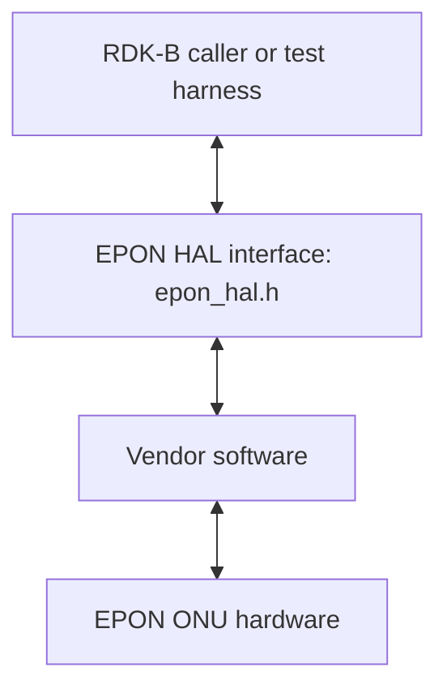
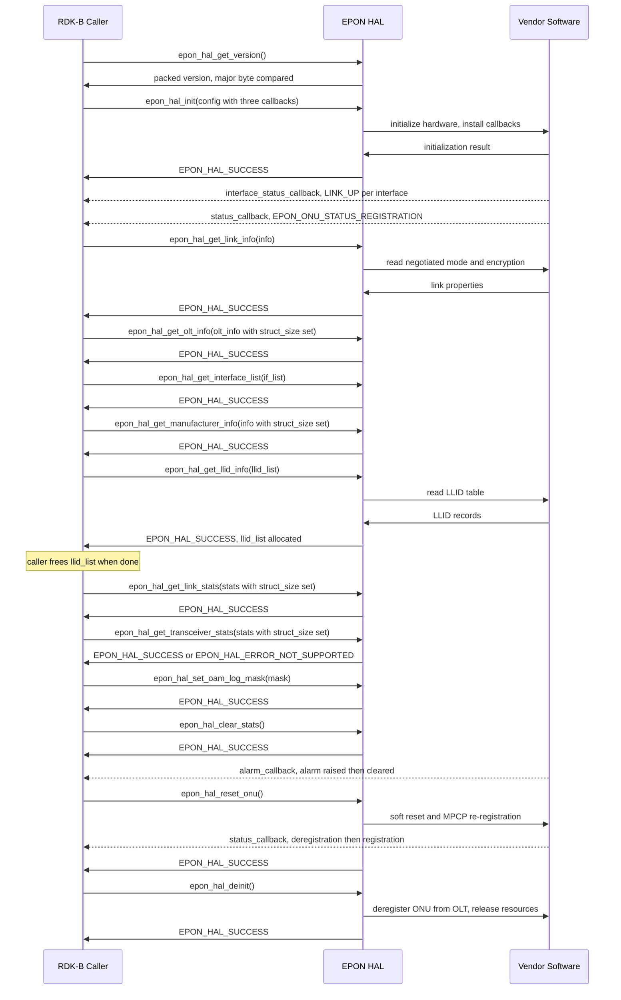
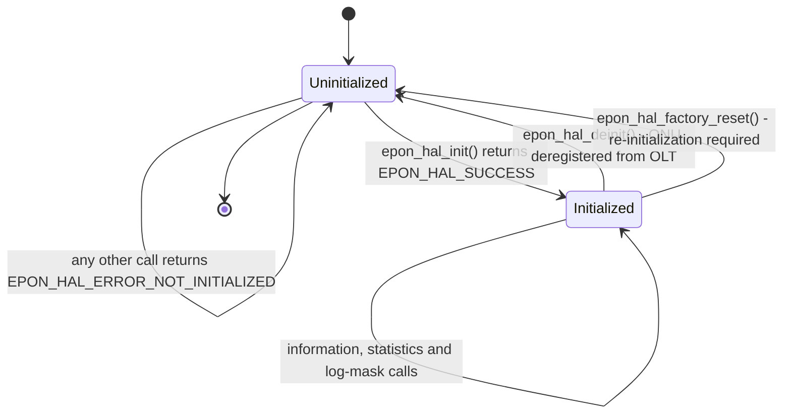
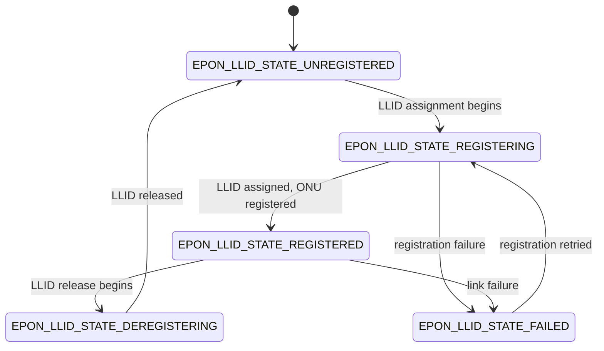

# EPON HAL Documentation

## Version History

| Date | Comment | Version |
| --- | --- | --- |
| 08/24/26 | First specification document for the EPON HAL. Covers the runtime execution requirements, the non-functional requirements, the complete public type surface and all fifteen declared functions. Describes release tag `v1.0.0` at interface version `1.0.0`. | 1.0.0 |

Four version identities travel with this repository, and this document keeps
them apart. Conflating them is the easiest way to mislead a caller, because only
one of the four tells a caller what the compiled contract is:

- **Document revision** - the `Version` column above. It moves when this page
  changes, and it says nothing about the interface.
- **Interface version** - the contract a caller compiles and links against,
  currently `1.0.0`. It is stated under `Variability Management` below, together
  with the runtime check a caller uses to verify it, because that is where a
  caller needs it.
- **Release tag** - the point in this repository's history that a consumer
  checks out. The sole tag today is `v1.0.0`, dated 23 January 2026.
- **Generated-site version string** - whatever `git describe --tags` reports
  when the documentation is built, passed to the generator as `PROJECT_VERSION`.
  A string of the form `v1.0.0-N-g<commit>` denotes N commits past a tag and
  **is not a version**: it identifies a build of this repository at an untagged
  commit, not a release of the interface.

Derived from the repository-root `CHANGELOG.md`, this repository's tag history,
and the version macros in [`epon_hal.h`](../../epon_hal.h) (lines 41-45).

## Acronyms

- `HAL` \- Hardware Abstraction Layer
- `RDK-B` \- Reference Design Kit for Broadband Devices
- `API` \- Application Programming Interface
- `ABI` \- Application Binary Interface
- `PON` \- Passive Optical Network
- `EPON` \- Ethernet Passive Optical Network
- `WAN` \- Wide Area Network, the operator-facing side of the gateway
- `ONU` \- Optical Network Unit, the subscriber-side device this interface
  abstracts
- `OLT` \- Optical Line Terminal, the operator-side device the `ONU` registers
  with
- `LLID` \- Logical Link Identifier
- `MPCP` \- Multi-Point Control Protocol
- `OAM` \- Operations, Administration and Maintenance
- `DOCSIS` \- Data Over Cable Service Interface Specification
- `DPoE` \- DOCSIS Provisioning of EPON
- `CPE` \- Customer Premises Equipment
- `FEC` \- Forward Error Correction
- `MAC` \- Media Access Control
- `OUI` \- Organizationally Unique Identifier
- `AES` \- Advanced Encryption Standard
- `TR-181` \- Broadband Forum Device Data Model

## Description

The diagram below describes a high-level software architecture of the EPON HAL
module stack.

The EPON `HAL` is the contract between an `RDK-B` caller and a vendor's
implementation of an Ethernet `PON` optical network unit on the `WAN` side of
the gateway. It exposes link and `LLID` information, `ONU` reset, transceiver
and link statistics, `OLT` and manufacturer information, and `OAM` log masking,
plus one `DPoE` call for the `CPE` `MAC` table.

**No dedicated middleware service owns this interface.** Most `RDK-B` `HAL`s are
driven by a middleware service that must be stopped before the `HAL` can be
exercised directly; EPON is one of the exceptions: the superproject inventory
records it as having no service dependency at `README.md` lines 102-103, which
is also why it does not appear in that document's stop-the-owning-service table
at lines 90-100. A caller - production middleware or a test harness - therefore
links the interface and drives it directly. The architecture chain above has no
service tier for that reason, and a reader should not look for one.

This repository holds the interface definition only. It ships the public header
and no implementation, build manifest or library; each vendor supplies its own
shared object behind the same declarations, which is what makes the contract
testable in isolation (the superproject `README.md`, lines 5-8).

Two properties of the interface shape everything below, and both are worth
stating before a reader reaches the detail. It is a **single global instance**:
no function takes a handle or a context, so initialization state is a property
of the process rather than of an object the caller holds. And it is
**synchronous with asynchronous notification alongside**: every function returns
its result as a return value, while status changes, alarms and interface
transitions arrive through three callbacks supplied at initialization.

Derived from [`epon_hal.h`](../../epon_hal.h) and the EPON entry in the
superproject `README.md` at line 26, under its `WAN and access technologies`
heading.

## Optional Components

`DPoE` - DOCSIS Provisioning of EPON - is the one optional part of this
interface. A platform that does not provision EPON through DOCSIS omits it, and
a caller must be prepared for that.

The optional surface is:

- `dpoe_hal_get_cpe_mac_table` (line 794), the single `DPoE` function, which
  returns the `CPE` `MAC` address table.
- The three types it needs: `dpoe_cpe_mac_type_t` (line 749), distinguishing a
  statically configured entry from a dynamically learned one;
  `dpoe_cpe_mac_entry_t` (line 758), one table row; and `dpoe_cpe_mac_table_t`
  (line 767), the table itself.
- `epon_vendor_alarm_t` (line 213), the vendor-specific alarm enumeration, which
  the header attributes to `DPoE`. It is reported through the same alarm
  callback as the standard alarms and is discriminated by
  `EPON_ALARM_TYPE_VENDOR_SPECIFIC`.

**How a caller determines whether `DPoE` is present.** Two mechanisms appear in
the header and they are not equivalent, so the distinction matters:

- **At runtime, authoritative.** `epon_hal_config_t.dpoe_supported` (line 406)
  is the flag the caller passes at initialization, and
  `dpoe_hal_get_cpe_mac_table` returns `EPON_HAL_ERROR_NOT_SUPPORTED` where
  `DPoE` is not supported (line 788). This is the mechanism a caller should use.
- **At compile time, documented intent only.** The header's `DPoE` section
  carries the instruction to "Enable with `-DEPON_HAL_DPOE_SUPPORT` at compile
  time" (line 743). **No conditional compilation is actually present.** The only
  preprocessor conditionals in the header are its include guard, its
  `__cplusplus` guards and the `HAL_LOG_FUNCTION` default; there is no `#ifdef`
  on that flag anywhere. The `DPoE` declarations are therefore compiled
  unconditionally, and a caller must not expect them to disappear when the flag
  is left undefined. The flag is recorded here as the header's stated intent
  rather than as observable behaviour.

Derived from [`epon_hal.h`](../../epon_hal.h), lines 213-223, 404-406 and
741-794.

## Component Runtime Execution Requirements

The requirements in this block are what a caller must satisfy to use the
interface correctly, and what a vendor must satisfy for a caller's expectations
to hold. Where the interface definition fixes a behaviour, this document states
it and cites the line that fixes it. Where it does not, this document says so
explicitly rather than supplying a plausible answer, because a caller that
assumes an unspecified behaviour will be wrong on some vendor's implementation.

### Initialization and Startup

This interface has an explicit lifecycle, and the ordering is a hard requirement
rather than a convention.

- `epon_hal_init` (line 482) **must be called before any other function in this
  interface.** It takes a pointer to an `epon_hal_config_t`, which must not be
  `NULL`, and the caller must set that structure's `struct_size` field to the
  compiled size of the structure it is passing (lines 405 and 467). The call
  installs the callback handlers, configures `DPoE` support where the caller has
  requested it, and initializes the interface mapping (lines 463-465).
- `epon_hal_deinit` (line 500) tears the interface down. It takes no arguments
  and returns a status code. It unregisters all callbacks, releases the memory
  allocated during initialization, performs hardware cleanup, and **deregisters
  the `ONU` from the `OLT`** (lines 497-498). After it returns, `epon_hal_init`
  must be called again before any other function is used (lines 489-490).
- `epon_hal_factory_reset` (line 629) also ends the initialized lifetime:
  re-initialization with `epon_hal_init` is **required** after a factory reset
  (lines 626-627). A caller that treats a factory reset as an ordinary operation
  and continues calling getters is relying on behaviour this interface does not
  grant.

**Return values a caller must handle at initialization.** `epon_hal_init`
documents five failure codes, and each says something different about what went
wrong (lines 474-479): `EPON_HAL_ERROR_INVALID_PARAM` where the configuration
pointer is `NULL`, its `struct_size` is invalid, or it contains invalid values;
`EPON_HAL_ERROR_WRONG_PON_MODE` where the hardware is provisioned for a
different `PON` technology, which the header illustrates with ITU `PON` rather
than EPON; `EPON_HAL_ERROR_HW_FAILURE` where hardware initialization failed;
`EPON_HAL_ERROR_CALLBACK_REG` where callback registration failed; and
`EPON_HAL_ERROR_TIMEOUT` where initialization blocked for more than three
minutes.

`EPON_HAL_ERROR_WRONG_PON_MODE` deserves a caller's attention because it is not
a transient fault. It reports a provisioning mismatch between the software stack
and the optical hardware, so retrying will not clear it; the deployment has to
be corrected.

**Startup dependencies.** This interface definition states no dependency on any
other service, daemon or boot-sequence step, and the superproject records EPON
as having no owning middleware service. Nothing here establishes what must be
running before `epon_hal_init` is called, beyond the optical hardware being
present and provisioned for EPON; a caller should not infer a startup ordering
that the interface does not state.

Derived from [`epon_hal.h`](../../epon_hal.h), lines 404-407, 458-500 and
613-629.

### Threading Model

**This interface does not specify a threading model, and a caller must not
assume one.** No function in the header carries a thread-safety statement, and
this repository contains no other document that establishes a `HAL`-wide policy.
Concretely, the following are all unspecified: whether two functions may be
called concurrently from different threads; whether one function may be called
re-entrantly; and which thread the three callbacks are invoked on.

The practical consequence for a caller is that concurrent access must be
serialised by the caller unless a specific vendor documents otherwise. That is
the conservative reading, and it is the only one this interface supports.

Vendors may implement internal threading and event mechanisms to meet their
operational requirements. Where they do, those mechanisms must be designed to
ensure thread safety when interacting with the interface, and proper cleanup of
allocated resources - memory, file handles, threads - is mandatory when the
implementation terminates or is deinitialized. That is a vendor obligation,
stated here because it is the contract a caller relies on; it is **not** a
guarantee this interface definition makes on any vendor's behalf.

Derived from [`epon_hal.h`](../../epon_hal.h) - specifically from the absence of
any thread-safety statement across all fifteen declarations, which was checked
rather than assumed.

### Process Model

**A single global instance, and the signatures establish it.** No function in
this interface takes a handle, an instance pointer or a context argument,
`epon_hal_init` takes only a configuration structure, and `epon_hal_deinit`
takes no arguments at all. Initialization state is therefore a property of the
process rather than of an object the caller holds, and one initialized instance
per process is what the interface supports. A caller cannot open two independent
sessions against this interface, because there is nothing in the signatures to
distinguish them.

**Access from multiple processes is not specified.** Nothing in the header
states whether two processes may hold the interface open against the same
hardware, nor what happens if one process calls `epon_hal_deinit` while another
is using it - which matters here, because deinitialization deregisters the `ONU`
from the `OLT` (lines 497-498) and so has effects well outside the calling
process. A caller must not assume that concurrent use from separate processes is
safe.

Derived from [`epon_hal.h`](../../epon_hal.h), the fifteen declarations at lines
456-794.

### Memory Model

Ownership in this interface runs in both directions, and the two directions are
not symmetrical. The caller owns the request and response structures it passes
in; the implementation owns - and hands over - the two variable-length arrays it
allocates. Getting either wrong leaks memory or corrupts it, so both are stated
explicitly below.

#### Caller Responsibilities

- **Allocate every structure passed to a function.** Each function that returns
  data takes a pointer to a caller-allocated structure and fills it. The
  interface allocates none of these outer structures.
- **Set `struct_size` on the five structures that carry it.** These are
  `epon_hal_link_stats_t` (line 277), `epon_hal_transceiver_stats_t` (line 303),
  `epon_onu_manufacturer_info_t` (line 358), `epon_olt_info_t` (line 399) and
  `epon_hal_config_t` (line 405). Each field must be set to the compiled size of
  that structure before the call. This is the interface's version-negotiation
  mechanism: it lets an implementation built against a later minor version
  detect that the caller was compiled against an earlier one. Omitting it is not
  benign - the corresponding functions document `EPON_HAL_ERROR_INVALID_PARAM`
  for an invalid `struct_size` at lines 475, 513, 538, 578 and 679.
- **Free the two arrays the implementation allocates.** They are named under
  `Module Responsibilities` below. Nothing else in this interface transfers
  ownership to the caller.
- **Treat every fixed-size character buffer as zero-terminated and bounded by
  its declared length.** The buffer lengths are macro constants at lines 50-60,
  and a caller must not read past the declared length of a field.

#### Module Responsibilities

- **Allocate exactly two arrays, and document them as caller-freed.** They are
  `epon_llid_list_t.llid_list` (line 352), sized from `llid_count` and returned
  by `epon_hal_get_llid_info`, restated in that function's own documentation at
  lines 552 and 560; and `dpoe_cpe_mac_table_t.cpe_list` (line 771), sized from
  `static_cpe_count` plus `dynamic_cpe_count` and returned by
  `dpoe_hal_get_cpe_mac_table`, restated at lines 782 and 792. In both cases the
  implementation allocates and **the caller must free**.
- **Release all internally allocated memory on deinitialization.**
  `epon_hal_deinit` is documented as releasing allocated memory and performing
  hardware cleanup (lines 497-498).
- **Manage internal memory for internal operations,** ensuring efficient
  resource management and leaving no leak behind when the implementation is torn
  down.

**One contrast worth drawing, because it is easy to get backwards.**
`epon_interface_list_t.interface` (line 386) is a **fixed-capacity array** of
`EPON_HAL_MAX_INTERFACES` entries - sixteen, at line 58 - whose populated prefix
is given by `interface_count`. It is embedded in the structure the caller
allocated, so it is **not** an allocation and there is nothing to free. Only the
two pointer members named above transfer ownership.

**What is not specified.** The lifetime of the `epon_alarm_info_t` pointer
passed to the alarm callback is not stated by this interface: the header does
not say whether the pointer remains valid after the callback returns. A caller
must therefore copy any alarm data it needs to retain rather than storing the
pointer.

Derived from [`epon_hal.h`](../../epon_hal.h), lines 50-60, 276-313, 349-353,
357-358, 384-387, 398-406, 497-498, 550-563 and 767-794.

### Power Management Requirements

**This interface does not specify any participation in power management.** No
function configures a power state, and nothing in the header establishes a role
for the interface in a system power transition.

One adjacent fact is worth stating precisely so it is not mistaken for a
power-management role. `EPON_VENDOR_ALARM_DYING_GASP` (line 215) reports
imminent power loss, and it reaches the caller through the ordinary alarm
callback. That is a **notification** the interface emits about a power event,
not a control the caller uses to manage power. A caller may use it to react to
impending loss of power; it cannot use this interface to influence a power
state.

Derived from [`epon_hal.h`](../../epon_hal.h), line 215, and from the absence of
any power-management function across the fifteen declarations.

### Asynchronous Notification Model

Three callbacks carry asynchronous notification, and all three are supplied as
function-pointer members of `epon_hal_config_t` and installed by
`epon_hal_init`. They are not registered by separate registration functions, so
there is no way to install, replace or remove a callback other than through
initialization.

- `status_callback` (line 409) receives an `epon_onu_status_t` value when the
  `ONU` status changes. The four values are `EPON_ONU_STATUS_LOS` where the
  physical layer is down or no signal is detected,
  `EPON_ONU_STATUS_DOWNSTREAM_SIGNAL_DETECTED` where optical power is present
  but the `ONU` is not yet registered, `EPON_ONU_STATUS_REGISTRATION` where
  LLID-0 is online including `MPCP` and `OAM`, and
  `EPON_ONU_STATUS_DEREGISTRATION` where LLID-0 has gone offline (lines
  161-166).
- `alarm_callback` (line 429) receives a pointer to an `epon_alarm_info_t`. That
  structure is a discriminated union: `alarm_type` selects between an
  `epon_hal_alarm_t` standard IEEE 802.3ah alarm and an `epon_vendor_alarm_t`
  vendor-specific alarm, carried in an anonymous union so the member is read
  directly off the structure (lines 241-246). `llid` identifies the affected
  `LLID`, or is `EPON_LLID_NOT_APPLICABLE` - `0xFFFF`, at line 65 - for a
  device-wide alarm. `is_active` distinguishes an alarm being raised from the
  same alarm being cleared, so a caller must read it rather than treating every
  invocation as a new fault. The header carries a worked example of this
  callback at lines 415-428.
- `interface_status_callback` (line 435) receives an `epon_onu_interface_info_t`
  by value when a layer-2 interface changes state. On a device with multiple
  `WAN` interfaces it is invoked **once per interface**, and the caller
  identifies which interface by the `name` field - the header gives `veip0` and
  `veip1` as examples (lines 431-434). Its `status` field is an
  `epon_interface_link_status_t`, either `EPON_ONU_INTF_STATUS_LINK_DOWN` or
  `EPON_ONU_INTF_STATUS_LINK_UP`.

**A caller must not take the third callback from `epon_hal_init`'s parameter
documentation.** That `@param` block lists only two callbacks, a status change
callback and an alarm callback (lines 469-472), and omits
`interface_status_callback` entirely. The structure declaration is the
authoritative statement of what the interface accepts, and it declares three.
This document follows the declaration.

`EPON_HAL_ERROR_CALLBACK_REG` (line 155) is the status `epon_hal_init` returns
when callback registration fails. Because installation happens only at
initialization, a caller that receives it has no partial-registration state to
unwind: initialization has failed.

By the convention this corpus uses, asynchronous entry points are marked in the
generated documentation with the `@execution callback` token, and a reader
tracing notification behaviour through the generated site should look for it.

**What is not specified.** Two properties a caller would reasonably want are
absent from this interface definition and must not be assumed: which thread each
callback is invoked on, and whether the implementation may invoke a callback
re-entrantly or while another call is in progress. Nor does the interface state
whether a callback may block. The conservative reading - return quickly, copy
what is needed, and synchronise anything shared with the caller's own threads -
is the only one this interface supports.

Derived from [`epon_hal.h`](../../epon_hal.h), lines 65, 155, 161-176, 184-187,
241-249, 404-436 and 466-479.

### Blocking calls

**One call has a documented bound.** `epon_hal_init` returns
`EPON_HAL_ERROR_TIMEOUT` where initialization "blocked for more than 3 minutes"
(line 479). That is an explicit statement that initialization may block, and
that three minutes is the limit past which the implementation must give up
rather than wait indefinitely. A caller should size its own startup timeout
accordingly, and should not treat initialization as a fast call.

**For the other fourteen functions, this interface does not specify whether a
call may block, and a caller must not assume either behaviour.** No other
declaration carries a timeout status, a non-blocking statement, or a bound on
completion time. Several of them plainly involve hardware transactions -
`epon_hal_reset_onu` initiates `MPCP` re-registration, and
`epon_hal_get_olt_info` reads data learned through `OAM` discovery - so a caller
that assumes they return immediately is relying on something the interface does
not grant.

Vendors should implement these functions to complete within a reasonable time
for the complexity of the operation, and should apply an internal timeout
wherever a hardware transaction can fail by not responding. That is a vendor
obligation stated for the caller's benefit; it is not a guarantee this interface
definition makes.

Derived from [`epon_hal.h`](../../epon_hal.h), line 479, and from the absence of
a blocking or timeout statement on the remaining fourteen declarations.

### Internal Error Handling

**Errors are returned synchronously, as the return value.** Fourteen of the
fifteen functions return `epon_hal_return_t`; the exception is
`epon_hal_get_version`, which returns a packed version number and cannot fail.
There is no error callback, no error queue and no out-of-band error channel in
this interface, so a caller learns of a failure at the point of the call.

The complete vocabulary is twelve codes (lines 146-159). Success is zero and
every failure is negative, so a caller may test for failure with a sign test,
but should switch on the specific code where the recovery differs.

| Code | Value | Meaning | What the caller should do |
| --- | --- | --- | --- |
| `EPON_HAL_SUCCESS` | 0 | Operation completed successfully. | Proceed; the output structure is populated. |
| `EPON_HAL_ERROR_INVALID_PARAM` | -1 | Invalid parameter provided. | Fix the call. A `NULL` pointer or an unset `struct_size` is the usual cause. Not retryable. |
| `EPON_HAL_ERROR_NOT_INITIALIZED` | -2 | The interface is not initialized. | Call `epon_hal_init` first, then retry. |
| `EPON_HAL_ERROR_HW_FAILURE` | -3 | A hardware operation failed. | Log with context and surface the fault. A retry may succeed if the cause was transient. |
| `EPON_HAL_ERROR_NOT_SUPPORTED` | -4 | The operation is not supported. | Treat the capability as absent on this platform and stop calling it. Not retryable. |
| `EPON_HAL_ERROR_TIMEOUT` | -5 | The operation timed out. | Documented only for `epon_hal_init`, at three minutes. Retry is reasonable; a repeat suggests a hardware or provisioning fault. |
| `EPON_HAL_ERROR_MEMORY` | -6 | Memory allocation failed. | Treat as a system-level resource failure. Release what the caller can and avoid a tight retry loop. |
| `EPON_HAL_ERROR_RESOURCE` | -7 | A resource is unavailable. | Retry after a backoff; distinguish it from a memory failure when logging. |
| `EPON_HAL_ERROR_CALLBACK_REG` | -8 | Callback registration failed. | Initialization has failed. There is no partial state to unwind, so treat the interface as uninitialized. |
| `EPON_HAL_ERROR_CONFIG` | -9 | Configuration error. | Returned by `epon_hal_factory_reset` when default configuration cannot be restored. Escalate; the device may need attention. |
| `EPON_HAL_ERROR_WRONG_PON_MODE` | -10 | Hardware is configured for the wrong `PON` mode, for example ITU `PON` instead of EPON. | Stop. This is a provisioning mismatch, not a transient fault; retrying cannot clear it. |
| `EPON_HAL_ERROR` | -11 | General error. | No specific recovery is implied. Log with full context. |

**Which codes a given function can return is per-function, and this document
does not generalise.** Each declaration lists its own set, and two functions
differ from the pattern in ways a caller should know about:

- `epon_hal_factory_reset` documents only `EPON_HAL_SUCCESS`,
  `EPON_HAL_ERROR_HW_FAILURE` and `EPON_HAL_ERROR_CONFIG` (lines 622-624). It
  does **not** document `EPON_HAL_ERROR_NOT_INITIALIZED`, so a caller should not
  expect it to guard on initialization the way the getters do.
- `epon_hal_get_version` documents no status codes at all. It returns a value
  rather than a status (line 444), so there is nothing to check for failure.

Every other function documents `EPON_HAL_ERROR_NOT_INITIALIZED`, so the general
rule - call `epon_hal_init` first - holds for them, with the two exceptions
above stated rather than smoothed over.

The implementation is responsible for handling internal system errors, such as a
failed allocation or an out-of-range access, and for reporting them through the
return value rather than allowing them to escape. For system-level errors it
should also log the detail needed to investigate, as described under `Logging
and debugging requirements`.

Derived from [`epon_hal.h`](../../epon_hal.h), lines 146-159, 444, 473-479,
511-514, 536-540, 554-557, 576-579, 590-593, 604-607, 621-624, 639-642, 657-660,
677-681, 712-715 and 784-788.

### Persistence Model

**This interface places no persistence obligation on the implementation, and
does not settle who persists configuration.** No function reads or writes a
persisted setting, and no declaration states that a value survives a restart.

One fact bears on the question without answering it. `epon_hal_factory_reset` is
documented as clearing all custom settings, statistics and operational
parameters, causing service disruption and "loss of all configuration", after
which re-initialization is required (lines 616-627). Something is therefore
being cleared, so configuration does exist somewhere. But the interface does not
say whether the implementation holds it, whether the caller supplies it afresh
at each initialization, or whether a lower layer persists it - and a caller must
not infer an owner from the existence of a reset.

What the interface does establish is that the configuration passed to
`epon_hal_init` is not persisted across a teardown: after `epon_hal_deinit`,
`epon_hal_init` must be called again with a configuration before any other
function is used (lines 489-490).

Derived from [`epon_hal.h`](../../epon_hal.h), lines 484-500 and 613-629.

## Non functional requirements

The following non-functional requirements should be supported by the EPON `HAL`
component.

### Logging and debugging requirements

This interface ships a complete, configurable logging front end rather than a
general instruction to log, and a caller or implementer should use it rather
than inventing one.

**The severity ladder has eight levels,** declared as `hal_log_level_t` at lines
76-85, in descending order of severity:

- **FATAL:** Fatal errors - critical failures.
- **ERROR:** Error conditions.
- **WARN:** Warning conditions.
- **NOTICE:** Normal but significant conditions.
- **INFO:** Informational messages.
- **OAM:** `OAM` protocol messages. This level is specific to this interface and
  exists so that `OAM` message logging can be filtered separately from
  everything else.
- **DEBUG:** Debug-level messages.
- **TRACE:** Trace-level detailed messages.

**The logging entry point** is the `HAL_LOG` macro at line 104. It takes a
level, a printf-style format string and the arguments matching it, and forwards
them together with the enclosing function name and line number to the backend.

**The backend is replaceable at compile time.** `HAL_LOG_FUNCTION` (lines
130-139) is guarded by `#ifndef`, so an implementer may define it before
including the header and redirect logging anywhere. The header carries worked
examples for the RDK Logger, for a plain formatted-output backend and for syslog
at lines 112-128. Where syslog is available it is the appropriate destination
for a system-level component; direct formatted output to a stream is a fallback
rather than a preference.

**The default backend writes to a specific file, and a reader should know where
to look.** If `HAL_LOG_FUNCTION` is not overridden, the default appends each
record to `/rdklogs/logs/EPONMANAGERLog.txt.0` (line 133). Each record carries
the numeric level, the function name and the line number ahead of the formatted
message, which is what makes the file parseable across vendors.

**`OAM` message logging is separately controlled,** and three constraints on it
are stated by the interface rather than left to an implementation:

- `epon_hal_set_oam_log_mask` (line 738) selects which `OAM` message types are
  logged, using `epon_oam_log_type_t` bit values combined with a bitwise OR
  (lines 260-269). `EPON_OAM_ALL` - `0xFFFFFFFF` - enables every type, and a
  mask of zero disables `OAM` logging entirely. Matching messages are logged at
  `HAL_LOG_LEVEL_OAM` (line 705).
- **The mask controls logging, not processing.** All `OAM` messages are always
  processed regardless of the mask (lines 717-719). A caller cannot use this
  function to suppress protocol handling, only to suppress the log records it
  produces.
- **Two message classes are not reachable through the mask.**
  Organization-specific `OAM` messages, which the header identifies as type
  `0xFE`, are covered by `EPON_OAM_VAR_REQUEST` and `EPON_OAM_VAR_RESPONSE`
  rather than by a flag of their own; and `MPCP` GATE and REPORT messages are
  **not available for logging at all**, because they are handled in hardware and
  are not visible to software (lines 255-258).

**One consequence a caller should not be surprised by.** If `HAL_LOG_FUNCTION`
is not defined, no output is produced (lines 720-721). Setting an `OAM` log mask
on a build with no logging backend therefore has no observable effect, and a
reader diagnosing missing log records should check the backend before the mask.

Derived from [`epon_hal.h`](../../epon_hal.h), lines 67-141, 251-269 and
700-738.

### Memory and performance requirements

**No memory footprint limit and no CPU utilisation limit are specified for this
interface.** The interface definition states neither, and this repository
contains no product specification that would. A caller sizing a platform should
take those figures from the product specification for the device rather than
from this document, and an implementer should not read the absence of a limit as
licence to be profligate.

What the interface does fix is the ownership split that determines where
allocation happens, and it is stated in full under `Memory Model` above: the
caller allocates every structure it passes in and frees the two arrays the
implementation hands over, and the implementation manages its own internal
memory and releases it on deinitialization. The only variable-length allocations
this interface performs are those two arrays, both sized from counts the same
structure reports, so a caller can bound its own memory use from the `LLID` and
`CPE` counts the device presents.

Derived from [`epon_hal.h`](../../epon_hal.h), lines 349-353 and 767-772, and
from the absence of any stated footprint or performance limit in this
repository.

### Quality Control

To ensure quality and reliability, third-party quality assurance tools such as
`Coverity`, `Black Duck` and `Valgrind` should be used to analyse an
implementation of this interface, with the goal of finding memory leaks, memory
corruption and comparable defects before deployment. Both an implementation and
any caller interacting with it must prioritise robust memory management -
disciplined allocation, deallocation and error handling - which matters more
than usual here because this interface transfers ownership of two allocated
arrays to the caller.

A zero-warning compilation policy is appropriate for an implementation of this
interface, with warnings enabled by default rather than suppressed.

**This interface cannot be exercised on the reference platforms, and every
statement here is bounded by that.** EPON is not available on the HUB6 or XER10
reference platforms (the superproject `README.md`, lines 102-103), so it
requires other hardware. Every behavioural statement in this document is
therefore **derived from the interface definition** in
[`epon_hal.h`](../../epon_hal.h) and has not been confirmed by running an
implementation. Where the interface definition does not establish a behaviour,
this document says so explicitly rather than supplying an answer that would read
as observed. A reader should treat the cited lines as the evidence for each
claim, and should validate anything beyond them against the vendor
implementation in front of them.

**Keeping this document true: the freshness trigger.** Every topic above names
the file its content was derived from. **Any change to a file this document
cites obliges a review of the topics that cite it** - which makes staleness
detectable from a diff rather than from a review-by date. In practice the
trigger fires on a change to [`epon_hal.h`](../../epon_hal.h), to the
repository-root `CHANGELOG.md`, or to the EPON entries in the superproject
`README.md`. Renaming or removing a declaration is the case most likely to
falsify this page silently, because the `API Surface` topic below names every
declared function by exact identifier.

The obligation needs an addressee. This repository publishes no `CODEOWNERS`
file, so the responsible reviewer is the maintainer group that the
repository-root `CONTRIBUTING.md` directs a contribution to: a change is offered
by forking this repository on GitHub and sending a pull request, and the RDK
Contributor License Agreement must be signed before it is accepted. A reviewer
acting on this trigger raises the documentation change through that same route.

Derived from the repository-root `CONTRIBUTING.md` and the superproject
`README.md`, lines 102-103.

### Licensing

The EPON `HAL` interface definition is licensed under the Apache License,
Version 2.0. The full licence text is in [`LICENSE`](../../LICENSE) at the
repository root, reachable also as [`COPYING`](../../COPYING); the attribution
notice is in [`NOTICE`](../../NOTICE), which records the component as Copyright
(c) 2025 RDK Management and licensed under the same terms. Every file in this
repository carries the Apache-2.0 header, [`epon_hal.h`](../../epon_hal.h)
included, at lines 1-18.

These files are also linked into this documentation directory as `LICENSE.md`,
`COPYING.md` and `NOTICE.md`, alongside `CHANGELOG.md` and `CONTRIBUTING.md`, so
that they render with this specification in the generated documentation.

An implementation of this interface is expected to be released under the Apache
License, Version 2.0.

Derived from [`LICENSE`](../../LICENSE), [`NOTICE`](../../NOTICE) and
[`epon_hal.h`](../../epon_hal.h), lines 1-18.

### Build Requirements

**This repository specifies no build artefact and no toolchain.** It ships an
interface header and nothing else: there is no implementation, no build
manifest, no recipe and no library declaration anywhere in it. A reader looking
for a shared-object name to link against, or a toolchain to build with, will not
find one here, and this document does not invent one - naming a library this
repository does not declare would be a fiction a caller could act on.

What is established is the shape of the dependency rather than its name. An
`RDK-B` `HAL` repository holds the interface definition only, and each vendor
ships its own shared object behind it (the superproject `README.md`, lines 5-8).
So a caller compiles against [`epon_hal.h`](../../epon_hal.h) and links against
whatever object the vendor supplies for the platform, with the name, the recipe
and the toolchain all coming from that vendor's delivery rather than from this
repository.

Two build-time inputs *are* specified by the header itself, and both are
described under `Variability Management` below: the `HAL_LOG_FUNCTION` logging
backend, which an implementer may define before including the header, and the
version macros a caller uses for a compile-time compatibility check.

The header depends only on the C standard library - `stdint.h`, `stdbool.h` and
`stdio.h`, at lines 23-25 - and carries `extern "C"` guards so it may be
included from C++ (lines 27-29 and 796-798).

Derived from [`epon_hal.h`](../../epon_hal.h), lines 20-29, and the superproject
`README.md`, lines 5-8. The absence of a build manifest was verified across this
repository rather than assumed.

### Variability Management

The role of adjusting this interface, guided by versioning, rests with
architecture requirements; vendors then align an implementation with a
designated version of the interface. Each interface version follows [Semantic
Versioning 2.0.0](https://semver.org/), and an implementation complies with a
specific version of it.

**The interface version, and how a caller checks it.** This is the identity a
caller compiles against, and it is distinct from the release tag and from the
generated-site version string, as `Version History` above sets out.

- The version is assembled at compile time from `EPON_HAL_VERSION_MAJOR`,
  `EPON_HAL_VERSION_MINOR` and `EPON_HAL_VERSION_PATCH` - currently 1, 0 and 0 -
  packed by the `EPON_HAL_MAKE_VERSION` macro into `EPON_HAL_API_VERSION` (lines
  41-45). The interface version is therefore **1.0.0**.
- The packed layout is `0xMMmmpppp`: the major version occupies the top byte,
  the minor version the next, and the patch level the low sixteen bits.
- At runtime, `epon_hal_get_version` (line 456) returns the packed version of
  the **implementation** the caller is actually linked against. The intended
  check is to compare the major byte of that value against the major byte of
  `EPON_HAL_API_VERSION` and to treat a mismatch as an incompatibility, which is
  exactly what the header's own worked example does at lines 447-454.
- The versioning contract the header states is that a major change is an
  incompatible `API` or `ABI` change, a minor change is a backwards-compatible
  addition, and a patch change is a backwards-compatible fix (lines 34-37). A
  caller can therefore accept a higher minor version safely, and must not accept
  a differing major version.

**Compile-time variability.** Two flags appear in this interface, and they are
not equally real:

- `HAL_LOG_FUNCTION` **is** genuinely compile-time variable. It is guarded by
  `#ifndef` at line 130, so defining it before including the header replaces the
  logging backend for the whole component; leaving it undefined selects the
  default that appends to `/rdklogs/logs/EPONMANAGERLog.txt.0`. This is the one
  supported build-time customisation point in the interface.
- `EPON_HAL_DPOE_SUPPORT` is **documented but not implemented as a
  conditional**. The header instructs an implementer to "Enable with
  `-DEPON_HAL_DPOE_SUPPORT` at compile time" (line 743), but no `#ifdef` on it
  exists anywhere in the file, so the `DPoE` declarations compile
  unconditionally. It is recorded here as stated intent; the mechanism that
  actually varies `DPoE` behaviour is the runtime pair described under `Optional
  Components` above.

Beyond these two, this interface specifies no compile-time variability. There is
no feature-flag family that adds or removes declarations, so the compiled
surface is the same fifteen functions on every platform.

Derived from [`epon_hal.h`](../../epon_hal.h), lines 31-45, 130-139, 438-456 and
741-743.

### Platform or Product Customization

Three points of variation exist between platforms and products, and a caller
should discover each at runtime rather than assuming it.

**`DPoE` support is the product-level option.** A platform that provisions EPON
through DOCSIS supports it; one that does not omits it. The caller declares its
expectation through `epon_hal_config_t.dpoe_supported` (line 406) at
initialization, and `dpoe_hal_get_cpe_mac_table` reports absence with
`EPON_HAL_ERROR_NOT_SUPPORTED` (line 788). The full optional surface is listed
under `Optional Components` above.

**The logging backend is the platform-level option,** through `HAL_LOG_FUNCTION`
as described under `Variability Management`. A platform integrating with the RDK
Logger, with syslog, or with no logging at all is accommodated without any
change to the interface.

**Line rate and encryption are negotiated with the `OLT`, so they vary per
deployment rather than per build.** `epon_hal_get_link_info` (line 644) reports
both through `epon_hal_link_info_t`:

- `mode` (line 380) is a **character string**, not an enumeration: a fixed
  buffer of `EPON_HAL_MODE_LEN` bytes - sixteen, at line 57 - carrying a value
  such as `1G-EPON` or `10G-EPON`. A caller must compare it as a string.
- `encryption` (line 381) **is** an enumeration, `epon_encryption_mode_t` (lines
  368-373), with four values: `EPON_ENCRYPTION_MODE_DISABLED` for no data
  encryption, `EPON_ENCRYPTION_MODE_AES_128` for `AES`-128 as specified by IEEE
  802.3ah, `EPON_ENCRYPTION_MODE_TRIPLE_CHURNING`, and
  `EPON_ENCRYPTION_MODE_AES_256`, which the header flags as an extension beyond
  IEEE 802.3ah. A caller that treats the fourth as standard behaviour will be
  wrong on a strictly conforming implementation.

A further per-deployment variation is the number and naming of `WAN` interfaces:
a device may present several, they are enumerated through
`epon_hal_get_interface_list` (line 665) up to `EPON_HAL_MAX_INTERFACES`, and
they are identified by name rather than by index, with `veip0` and `veip1` given
as examples (lines 431-434).

Beyond these, product variability is not specified by this interface. In
particular it defines no per-product limits on `LLID` count or `CPE` table size:
both are reported by the device at runtime through
`epon_llid_list_t.max_llid_count` (line 350) and `dpoe_cpe_mac_table_t.max_cpe`
(line 768), and a caller must read them rather than assuming a platform maximum.

Derived from [`epon_hal.h`](../../epon_hal.h), lines 57-58, 349-350, 368-386,
404-406, 431-435, 644-665, 767-768 and 788.

## Interface API Documentation

The authoritative per-function reference is the inline documentation in
[`epon_hal.h`](../../epon_hal.h), which the documentation generator extracts
into this site. Every declaration there carries its purpose, its parameter
directions and constraints, and the status codes it can return. This block gives
the concepts a caller needs in order to read that reference correctly, the
public type surface, and the complete index of declared functions.

To use this interface from a component, include [`epon_hal.h`](../../epon_hal.h)
and link against the shared object the platform vendor supplies - see `Build
Requirements` above for why no library name is stated here. The header is also
reachable at [`include/epon_hal.h`](../../include/epon_hal.h), which is a
symlink to the same file; the repository-root path is the published include
path.

### Theory of operation and key concepts

The interface abstracts one EPON `ONU` behind a single global instance. A caller
initializes it once, supplying its callbacks and its `DPoE` expectation in one
configuration structure; thereafter it reads link, `LLID`, transceiver, `OLT`,
manufacturer and interface information through synchronous getters, performs the
three maintenance operations, and receives status changes, alarms and interface
transitions asynchronously through the callbacks it registered. Registration
with the `OLT` is performed by the device rather than driven by the caller: the
caller observes it through status notifications and through the information that
becomes available once it has completed.

#### Object Lifecycles

- **Creation.** The `HAL` instance is the only object with a lifecycle in this
  interface, and the caller does not hold a reference to it. `epon_hal_init`
  (line 482) brings it into an initialized state from a caller-supplied
  `epon_hal_config_t`; because no handle is returned, "initialized" is a
  property of the process.
- **Usage.** The caller allocates each request or response structure, sets
  `struct_size` on the five structures that carry it, and passes a pointer for
  the implementation to fill. These structures are plain data with no lifecycle
  of their own beyond the caller's own allocation.
- **Destruction.** `epon_hal_deinit` (line 500) ends the initialized state,
  releasing what initialization allocated and deregistering the `ONU` from the
  `OLT`. Separately, the caller must free the two arrays the implementation
  allocated for it - `epon_llid_list_t.llid_list` and
  `dpoe_cpe_mac_table_t.cpe_list` - as `Memory Model` above sets out.
  `epon_hal_factory_reset` (line 629) also ends the initialized state, because
  re-initialization is required afterwards (lines 626-627).
- **Unique identifiers.** Two identify things a caller reasons about. An `LLID`
  is identified by `epon_llid_info_t.llid_value` (line 341), and the reserved
  value `EPON_LLID_NOT_APPLICABLE` - `0xFFFF`, at line 65 - marks an alarm as
  device-wide rather than belonging to any `LLID`. An interface is identified by
  the `name` field of `epon_onu_interface_info_t` (line 185), such as `veip0`,
  and **not** by its index in the interface array; a caller matching interfaces
  across calls must match on the name.

#### Method Sequencing

- **`epon_hal_init` first, always.** Every function except the two noted under
  `Internal Error Handling` documents `EPON_HAL_ERROR_NOT_INITIALIZED`, so
  calling before initialization is a defined failure rather than undefined
  behaviour.
- **Then any getter, in any order.** The information and statistics functions
  have no ordering constraint between them. What they can return depends on
  device state rather than on call order, which `State-Dependent Behavior` below
  sets out.
- **`epon_hal_clear_stats` resets what the statistics getters read.** It zeroes
  the link statistics counters - frame counts, byte counts, `FEC` error counters
  and `MAC` reset counters - and **optical power measurements are not affected**
  (line 588), because those are instantaneous measurements rather than counters.
  A caller computing a rate across an interval must not clear counters inside
  that interval.
- **`epon_hal_reset_onu` is disruptive but does not require re-initialization.**
  It deregisters the `ONU`, performs a soft reset and re-registers through the
  `MPCP` discovery and registration procedure (lines 600-602), causing
  **temporary** service disruption (line 609). The interface stays initialized
  across it, so the caller continues using it and should expect status
  notifications as registration proceeds.
- **`epon_hal_factory_reset` is disruptive and *does* require
  re-initialization.** It clears all custom settings, statistics and operational
  parameters, causing service disruption and loss of all configuration, and
  `epon_hal_init` must be called again afterwards (lines 616-627). This is the
  one sequencing difference between the two reset operations, and confusing them
  leaves a caller issuing calls against a deinitialized interface.
- **`epon_hal_deinit` last.** After it returns, `epon_hal_init` must be called
  again before any other function is used (lines 489-490).

#### State-Dependent Behavior

What this interface returns depends on the device's registration state, and
three of these are documented rather than inferred.

- **Before initialization,** the initialization-guarded functions return
  `EPON_HAL_ERROR_NOT_INITIALIZED`. The two exceptions -
  `epon_hal_factory_reset`, which documents only success, hardware failure and
  configuration failure, and `epon_hal_get_version`, which documents no status
  codes at all - are set out under `Internal Error Handling` above. A caller
  should not generalise the guard to all fifteen functions.
- **Before `ONU` registration completes, `OLT` information is unavailable.** The
  `OLT` data is learned during `MPCP` registration and `OAM` discovery (lines
  671-672), so `epon_hal_get_olt_info` returns `EPON_HAL_ERROR_NOT_SUPPORTED`
  while the `ONU` is not registered (line 681), and some fields may be
  vendor-specific and absent on a given `OLT` (line 684).
- **Interface state gates the `ONU` status transition.**
  `EPON_ONU_STATUS_REGISTRATION` is reported **only after all configured
  interfaces are operational**, that is once each has reached
  `EPON_ONU_INTF_STATUS_LINK_UP` (lines 662-663). A caller waiting for the
  device to be usable should therefore watch the per-interface notifications as
  well as the aggregate status, because the aggregate is the later of the two.
- **Transceiver statistics may be unavailable regardless of state.**
  `epon_hal_get_transceiver_stats` documents `EPON_HAL_ERROR_NOT_SUPPORTED`
  (line 540), so optical measurements are a capability a caller must probe
  rather than assume.
- **`DPoE` calls report absence rather than failing obscurely.**
  `dpoe_hal_get_cpe_mac_table` returns `EPON_HAL_ERROR_NOT_SUPPORTED` where
  `DPoE` is not supported (line 788).

**One correction a reader of the header will need.** Two comments in
[`epon_hal.h`](../../epon_hal.h), at lines 394 and 683, describe `OLT`
information as available after successful registration "(OAM_REGISTERED or
LINK_UP state)". No enumerator of that first name exists anywhere in the
interface - it is not declared, and a caller must not code against it. The
declared names for those two conditions are `EPON_ONU_STATUS_REGISTRATION` (line
164), from `epon_onu_status_t`, and `EPON_ONU_INTF_STATUS_LINK_UP` (line 175),
from `epon_interface_link_status_t`. This document uses the declared names
throughout.

Derived from [`epon_hal.h`](../../epon_hal.h), lines 161-176, 321-327, 340-341,
394, 404-436, 458-500, 540, 583-629, 662-663, 671-684 and 788.

### Data Structures and Defines

Every type below is public and a caller must construct or interpret it. Line
numbers are declaration sites in [`epon_hal.h`](../../epon_hal.h).

**Callback members.** All three are function-pointer members of
`epon_hal_config_t` and are installed by `epon_hal_init`; this interface
declares no separate registration function and no standalone callback typedef.
`status_callback` (line 409) takes an `epon_onu_status_t` by value;
`alarm_callback` (line 429) takes a pointer to a const `epon_alarm_info_t`; and
`interface_status_callback` (line 435) takes an `epon_onu_interface_info_t` by
value. Their semantics are set out under `Asynchronous Notification Model`
above.

**Enumerations - thirteen.**

| Type | Line | What it represents |
| --- | --- | --- |
| `hal_log_level_t` | 76 | The eight-level logging severity ladder, including the interface-specific `OAM` level. |
| `epon_hal_return_t` | 146 | The twelve-code status vocabulary returned by fourteen of the fifteen functions. |
| `epon_onu_status_t` | 161 | Aggregate `ONU` status, from loss of signal through registration to deregistration. Delivered by `status_callback`. |
| `epon_interface_link_status_t` | 173 | Per-interface link state, up or down. Carried in `epon_onu_interface_info_t`. |
| `epon_hal_alarm_t` | 195 | The seven standard IEEE 802.3ah alarms, plus a terminating maximum that is not itself an alarm. |
| `epon_vendor_alarm_t` | 213 | The eight vendor-specific alarms the header attributes to `DPoE`, including dying gasp and optical-power thresholds, plus a terminating maximum. |
| `epon_alarm_type_t` | 230 | The discriminator selecting which member of the alarm union is valid. |
| `epon_oam_log_type_t` | 260 | A **bitmask** of `OAM` message types for the log mask. Combine values with a bitwise OR; `EPON_OAM_ALL` is every type. |
| `epon_llid_mode_t` | 316 | Whether an `LLID` is unicast point-to-point emulation or broadcast and multicast shared emulation. |
| `epon_llid_state_t` | 321 | The five-state `LLID` registration lifecycle. Drawn under `State Diagram` below. |
| `epon_llid_forwarding_state_t` | 329 | Whether traffic on an `LLID` is blocked, forwarded, or in a limited learning state. |
| `epon_encryption_mode_t` | 368 | The four negotiated encryption modes. `EPON_ENCRYPTION_MODE_AES_256` is flagged as an extension beyond IEEE 802.3ah. |
| `dpoe_cpe_mac_type_t` | 749 | Whether a `CPE` `MAC` entry is statically configured or dynamically learned. |

**Structures - thirteen.** The five marked with an asterisk carry a
`struct_size` field the caller must set before the call.

| Type | Line | What it represents |
| --- | --- | --- |
| `epon_onu_interface_info_t` | 184 | One interface: its name and its link status. |
| `epon_alarm_info_t` | 241 | One alarm event: the type discriminator, an anonymous union holding either the standard or vendor alarm, the affected `LLID`, and whether the alarm is being raised or cleared. |
| `epon_hal_link_stats_t` \* | 276 | Link counters. Nine fields carry explicit `TR-181` mappings under `Device.Optical.Interface.{i}.Stats`; the remainder, including the `FEC` counters, are documented as EPON extensions. |
| `epon_hal_transceiver_stats_t` \* | 302 | Optical measurements: transmit and receive power with their thresholds, all `TR-181`-mapped, plus laser bias current, temperature and supply voltage as vendor extensions. |
| `epon_llid_info_t` | 340 | One `LLID`: its value, mode, state, forwarding state, whether encryption is enabled, and its local `MAC` address. |
| `epon_llid_list_t` | 349 | The `LLID` table: maximum supported, current count, and a pointer to an array **the implementation allocates and the caller must free**. |
| `epon_onu_manufacturer_info_t` \* | 357 | `ONU` identity - manufacturer, model number, hardware and software versions, serial number and vendor `OUI` - with the first five mapped to `TR-181` `Device.DeviceInfo` parameters. |
| `epon_hal_link_info_t` | 379 | Negotiated link properties: the operational mode as a **string**, and the encryption mode as an enumeration. |
| `epon_interface_list_t` | 384 | The interface table: a count plus a **fixed-capacity** array of `EPON_HAL_MAX_INTERFACES` entries. Nothing to free. |
| `epon_olt_info_t` \* | 398 | `OLT` identity learned during registration: its `OAM` `MAC` address from `MPCP` GATE messages, and its vendor `OUI` from the `OAM` Information message. |
| `epon_hal_config_t` \* | 404 | The initialization contract: the `DPoE` expectation flag and the three callback members. |
| `dpoe_cpe_mac_entry_t` | 758 | One `CPE` `MAC` table row: address, static or dynamic type, and age in seconds, which is zero for a static entry. |
| `dpoe_cpe_mac_table_t` | 767 | The `CPE` `MAC` table: maximum supported, static and dynamic counts, and a pointer to an array **the implementation allocates and the caller must free**. |

**Macro constants.**

| Macro group | Lines | What it provides |
| --- | --- | --- |
| Version macros | 41-45 | `EPON_HAL_VERSION_MAJOR`, `_MINOR` and `_PATCH`, the `EPON_HAL_MAKE_VERSION` packing macro, and the assembled `EPON_HAL_API_VERSION`. See `Variability Management`. |
| Buffer lengths | 50-60 | Eleven constants bounding every fixed-size field: `EPON_HAL_MAC_ADDR_LEN` 6, `EPON_HAL_VENDOR_OUI_LEN` 3, `EPON_HAL_MANUFACTURER_LEN` 32, `EPON_HAL_MODEL_NUMBER_LEN` 16, `EPON_HAL_HW_VERSION_LEN` 16, `EPON_HAL_SW_VERSION_LEN` 16, `EPON_HAL_SERIAL_NUMBER_LEN` 32, `EPON_HAL_MODE_LEN` 16, `EPON_HAL_MAX_INTERFACES` 16, `EPON_HAL_INTERFACE_NAME_LEN` 32 and `EPON_HAL_OLT_VENDOR_INFO_LEN` 64. |
| `LLID` sentinel | 65 | `EPON_LLID_NOT_APPLICABLE`, `0xFFFF`, marking an alarm as device-wide rather than `LLID`-specific. |
| Logging macros | 104, 131 | `HAL_LOG`, the entry point, and `HAL_LOG_FUNCTION`, the replaceable backend. See `Logging and debugging requirements`. |

### API Surface

All fifteen declared functions, by exact identifier, grouped by function.
Per-function detail - parameter directions and constraints, and the status codes
each can return - is in the inline documentation at the cited line in
[`epon_hal.h`](../../epon_hal.h).

**Lifecycle** - two functions. Every other function in this interface depends on
these.

| Function | Line | Purpose |
| --- | --- | --- |
| `epon_hal_init` | 482 | Initialize the interface from a caller-supplied configuration, installing the three callbacks. Must precede every other call. |
| `epon_hal_deinit` | 500 | Tear the interface down, releasing resources and deregistering the `ONU` from the `OLT`. Re-initialization is required afterwards. |

**Version** - one function.

| Function | Line | Purpose |
| --- | --- | --- |
| `epon_hal_get_version` | 456 | Return the implementation's packed `API` version as `0xMMmmpppp`, for a runtime `ABI` compatibility check. Returns a value, not a status code. |

**Information** - five functions, all read-only.

| Function | Line | Purpose |
| --- | --- | --- |
| `epon_hal_get_link_info` | 644 | Read the negotiated operational mode and encryption mode. |
| `epon_hal_get_llid_info` | 563 | Read the `LLID` table. **Allocates an array the caller must free.** |
| `epon_hal_get_olt_info` | 698 | Read the `OLT` `MAC` address and vendor `OUI` learned during registration. Unavailable until the `ONU` is registered. |
| `epon_hal_get_manufacturer_info` | 581 | Read `ONU` identity: manufacturer, model, hardware and software versions, serial number and vendor `OUI`. |
| `epon_hal_get_interface_list` | 665 | Enumerate the configured interfaces with their names and link states. |

**Statistics** - three functions.

| Function | Line | Purpose |
| --- | --- | --- |
| `epon_hal_get_link_stats` | 525 | Read link counters: packets, bytes, errors, discards, `FEC` counters and `MAC` resets. |
| `epon_hal_get_transceiver_stats` | 542 | Read optical measurements and their thresholds. May be unsupported on a given platform. |
| `epon_hal_clear_stats` | 595 | Reset the link counters. Optical power measurements are not affected. |

**Maintenance** - four functions, of which the first two are service-affecting.

| Function | Line | Purpose |
| --- | --- | --- |
| `epon_hal_reset_onu` | 611 | Soft-reset the `ONU` and re-register through `MPCP` discovery. Temporary disruption; no re-initialization needed. |
| `epon_hal_factory_reset` | 629 | Restore factory defaults, losing all configuration. **Re-initialization is required afterwards.** |
| `epon_hal_set_oam_log_mask` | 738 | Select which `OAM` message types are logged. Affects logging only, never processing. |
| `dpoe_hal_get_cpe_mac_table` | 794 | Read the `CPE` `MAC` table. `DPoE` only; **allocates an array the caller must free.** |

### Sequence Diagram

The exchange below shows a caller initializing the interface, receiving
asynchronous notification as the device registers, reading information and
statistics, and tearing the interface down. Every function named is a declared
identifier.

`dpoe_hal_get_cpe_mac_table` is omitted from the diagram deliberately: it is
optional, and its place in the sequence is any point after initialization on a
`DPoE`-capable platform, with the same caller-frees obligation as
`epon_hal_get_llid_info`.

Derived from [`epon_hal.h`](../../epon_hal.h): every participant exchange above
names one of the fifteen declarations at lines 456-794, and the notification
arrows name the three callback members declared at lines 409, 429 and 435.

### State Diagram

**The `HAL` lifecycle.** These transitions are established by the interface:
`epon_hal_init` must precede every other call, `epon_hal_deinit` requires
`epon_hal_init` to be called again afterwards (lines 489-490), and
`epon_hal_factory_reset` also requires re-initialization (lines 626-627).
`epon_hal_reset_onu` is shown as a self-transition because it causes temporary
disruption without ending the initialized state (line 609).

**The `LLID` registration lifecycle.** `epon_llid_state_t` (lines 321-327) names
the stages of a registration *process* rather than a set of independent
readings, so the progression below is drawn from those names. A caller observes
the current stage through `epon_llid_info_t.state` in the table
`epon_hal_get_llid_info` returns; it does not drive these transitions.

**Aggregate `ONU` status is a set of reported values, not a state machine, and
no diagram is drawn for it.** `epon_onu_status_t` (lines 161-166) has four
values - `EPON_ONU_STATUS_LOS`, `EPON_ONU_STATUS_DOWNSTREAM_SIGNAL_DETECTED`,
`EPON_ONU_STATUS_REGISTRATION` and `EPON_ONU_STATUS_DEREGISTRATION` - and while
they read as a progression, **this interface does not specify which transitions
between them are legal, nor in what order they occur.** One ordering constraint
*is* stated and is recorded under `State-Dependent Behavior` above:
`EPON_ONU_STATUS_REGISTRATION` is reported only after every configured interface
has reached `EPON_ONU_INTF_STATUS_LINK_UP` (lines 662-663). Beyond that single
constraint, a caller must treat these as values to read rather than as edges to
rely on, and must not assume it will observe every value or observe them in a
fixed sequence.

The same applies to `epon_interface_link_status_t` (lines 173-176), which has
the two values `EPON_ONU_INTF_STATUS_LINK_DOWN` and
`EPON_ONU_INTF_STATUS_LINK_UP`: transitions between them are reported through
`interface_status_callback`, and the interface constrains neither their timing
nor their ordering.

Derived from [`epon_hal.h`](../../epon_hal.h), lines 161-176, 321-327, 484-500,
597-629 and 662-663.
