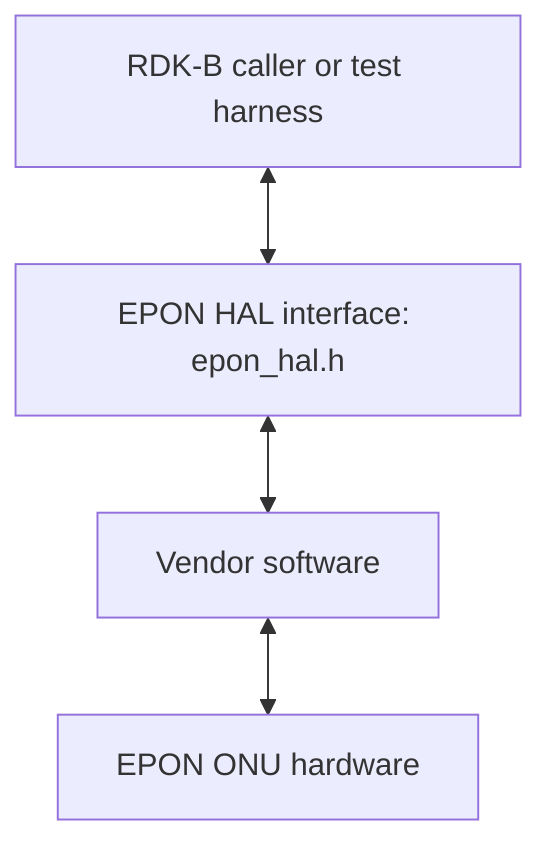
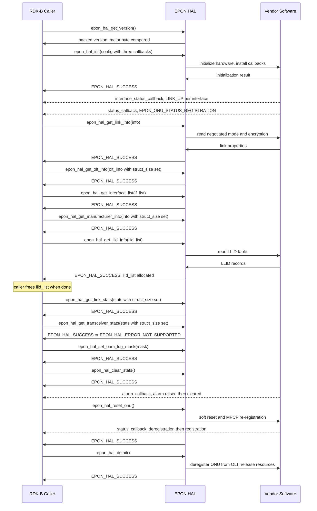
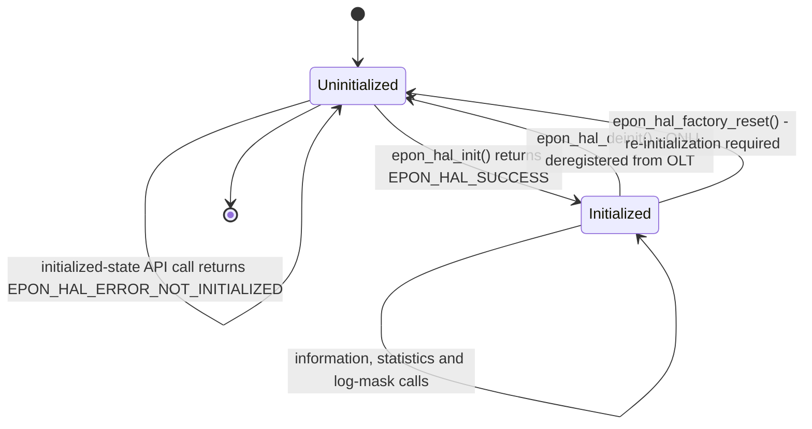
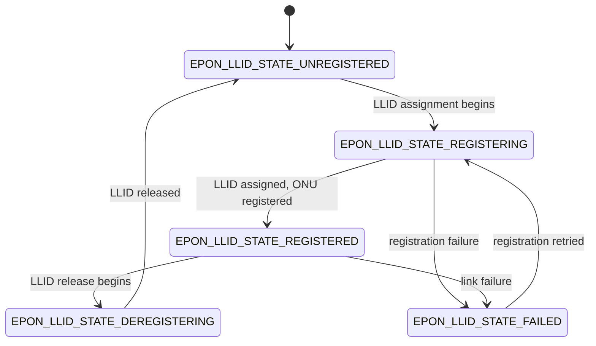

# EPON HAL Documentation

## Version History

| Date | Comment | Version |
| --- | --- | --- |
| 08/24/26 | First specification document for the EPON HAL. Covers the runtime execution requirements, the non-functional requirements, the complete public type surface and all fifteen declared functions. Describes release tag `v1.0.0` at interface version `1.0.0`. | 1.0.0 |

The following version identifiers are used with the EPON HAL repository:

- **Document revision** - the `Version` column above identifies the revision of
  this specification.
- **Interface version** - the `API`/`ABI` contract that callers compile against.
  The current interface version is `1.0.0`.
- **Release tag** - identifies a released repository revision. The current
  release tag is `v1.0.0`.
- **Generated-site version string** - documentation builds may use the value
  returned by `git describe --tags` as `PROJECT_VERSION`.

The public interface version is defined by `EPON_HAL_VERSION_MAJOR`,
`EPON_HAL_VERSION_MINOR` and `EPON_HAL_VERSION_PATCH`, and applications can use
`epon_hal_get_version()` to verify implementation compatibility at runtime.

## Acronyms

- `HAL` \- Hardware Abstraction Layer
- `RDK-B` \- Reference Design Kit for Broadband Devices
- `API` \- Application Programming Interface
- `ABI` \- Application Binary Interface
- `PON` \- Passive Optical Network
- `EPON` \- Ethernet Passive Optical Network
- `WAN` \- Wide Area Network, the operator-facing side of the gateway
- `ONU` \- Optical Network Unit, the subscriber-side device this interface
  abstracts
- `OLT` \- Optical Line Terminal, the operator-side device the `ONU` registers
  with
- `LLID` \- Logical Link Identifier
- `MPCP` \- Multi-Point Control Protocol
- `OAM` \- Operations, Administration and Maintenance
- `DOCSIS` \- Data Over Cable Service Interface Specification
- `DPoE` \- DOCSIS Provisioning of EPON
- `CPE` \- Customer Premises Equipment
- `FEC` \- Forward Error Correction
- `MAC` \- Media Access Control
- `OUI` \- Organizationally Unique Identifier
- `AES` \- Advanced Encryption Standard
- `TR-181` \- Broadband Forum Device Data Model

## Description

The diagram below describes a high-level software architecture of the EPON HAL
module stack.

The EPON `HAL` is the contract between an `RDK-B` caller and a vendor's
implementation of an Ethernet `PON` optical network unit on the `WAN` side of
the gateway. It exposes link and `LLID` information, `ONU` reset, transceiver
and link statistics, `OLT` and manufacturer information, and `OAM` log masking,
plus one `DPoE` call for the `CPE` `MAC` table.

The public EPON HAL interface is defined in [`epon_hal.h`](../../epon_hal.h), and
the platform vendor provides the implementation behind the common declarations.
`RDK-B` callers and test applications use this interface to access EPON functions
through the vendor implementation.

The interface uses a **single global lifecycle** managed by `epon_hal_init` and
`epon_hal_deinit`, with initialization state associated with the HAL within the
calling process. `API` operations return synchronously, while status changes,
alarms and interface transitions are delivered through three callbacks supplied
at initialization.

## Optional Components

`DPoE` - DOCSIS Provisioning of EPON - is the optional extension provided by this
interface.

The optional surface is:

- `dpoe_hal_get_cpe_mac_table`, which returns the `CPE` `MAC` address table.
- `dpoe_cpe_mac_type_t`, distinguishing a statically configured entry from a
  dynamically learned one.
- `dpoe_cpe_mac_entry_t`, representing one table row.
- `dpoe_cpe_mac_table_t`, representing the complete `CPE` `MAC` table.
- `epon_vendor_alarm_t`, the vendor-specific alarm enumeration reported through
  the common alarm callback with `EPON_ALARM_TYPE_VENDOR_SPECIFIC`.

`epon_hal_config_t.dpoe_supported` carries the `DPoE` support setting during
initialization. On `DPoE`-capable platforms, `dpoe_hal_get_cpe_mac_table`
returns the current `CPE` `MAC` table.

## Component Runtime Execution Requirements

This section describes the lifecycle, execution, memory, notification and
error-handling requirements of the EPON HAL interface.

### Initialization and Startup

The EPON HAL has an explicit lifecycle and initialization order.

- `epon_hal_init` **must be called before other EPON HAL functions.** It takes a
  pointer to `epon_hal_config_t`, which must not be `NULL`, and the caller sets
  `struct_size` to `sizeof(epon_hal_config_t)`. The call installs the callback
  handlers, configures `DPoE` support and initializes the interface mapping.
- `epon_hal_deinit` tears the interface down. It unregisters callbacks, releases
  resources allocated during initialization, performs hardware cleanup and
  deregisters the `ONU` from the `OLT`. After deinitialization,
  `epon_hal_init` is called again before further HAL use.
- `epon_hal_factory_reset` restores factory defaults, clears custom settings and
  statistics, restores default operational parameters and requires
  re-initialization with `epon_hal_init`.

`epon_hal_init` returns `EPON_HAL_ERROR_INVALID_PARAM` for an invalid
configuration, `EPON_HAL_ERROR_WRONG_PON_MODE` when the hardware is provisioned
for another `PON` technology, `EPON_HAL_ERROR_HW_FAILURE` for hardware
initialization failure, `EPON_HAL_ERROR_CALLBACK_REG` for callback registration
failure, and `EPON_HAL_ERROR_TIMEOUT` when initialization is blocked for more
than three minutes.

### Threading Model

EPON HAL `API` calls use a synchronous request/return model. Asynchronous
status, alarm and interface notifications are delivered through callbacks
supplied in
`epon_hal_config_t`.

Vendor implementations manage the internal threading and event mechanisms used
to communicate with EPON hardware and deliver these notifications. Internal
resources are released during deinitialization.

### Process Model

The EPON HAL exposes one process-level initialization lifecycle.
`epon_hal_init` establishes the HAL state and `epon_hal_deinit` releases it.

### Memory Model

Memory ownership is split between the caller and the HAL implementation. The
caller owns the request and fixed response structures it passes to the HAL. The
HAL allocates the two variable-length arrays returned for `LLID` information and
the `DPoE` `CPE` `MAC` table.

#### Caller Responsibilities

- **Allocate every structure passed to a function.** Each function that returns
  data takes a pointer to a caller-allocated structure and fills it. The
  interface allocates none of these outer structures.
- **Set `struct_size` on the five structures that carry it.** These are
  `epon_hal_link_stats_t`, `epon_hal_transceiver_stats_t`,
  `epon_onu_manufacturer_info_t`, `epon_olt_info_t` and
  `epon_hal_config_t`. Each field is set to the compiled size of the structure
  before the corresponding `API` call. `API`s that validate this field return
  `EPON_HAL_ERROR_INVALID_PARAM` when the value is invalid.
- **Free the two arrays allocated by the HAL.** These are
  `epon_llid_list_t.llid_list` and `dpoe_cpe_mac_table_t.cpe_list`, described
  under `Module Responsibilities` below.
- **Use the declared buffer-size constants** for fixed-size character and byte
  arrays defined by the interface.

#### Module Responsibilities

- **Allocate the two variable-length result arrays.**
  `epon_llid_list_t.llid_list` is sized from `llid_count` and returned by
  `epon_hal_get_llid_info`. `dpoe_cpe_mac_table_t.cpe_list` is sized from
  `static_cpe_count + dynamic_cpe_count` and returned by
  `dpoe_hal_get_cpe_mac_table`. In both cases the implementation allocates the
  array and **the caller must free it**.
- **Release all internally allocated memory on deinitialization.**
  `epon_hal_deinit` is documented as releasing allocated memory and performing
  hardware cleanup.
- **Manage internal memory for internal operations,** ensuring efficient
  resource management and leaving no leak behind when the implementation is torn
  down.

`epon_interface_list_t.interface` is a **fixed-capacity array** of
`EPON_HAL_MAX_INTERFACES` entries whose populated prefix is given by
`interface_count`. It is embedded in the caller-allocated structure. The
variable-length ownership transfer applies to `epon_llid_list_t.llid_list` and
`dpoe_cpe_mac_table_t.cpe_list`.

### Power Management Requirements

`EPON_VENDOR_ALARM_DYING_GASP` reports imminent power loss through the common
`alarm_callback`. The notification is delivered as a vendor-specific alarm with
`EPON_ALARM_TYPE_VENDOR_SPECIFIC`.

### Asynchronous Notification Model

Three callbacks carry asynchronous notifications. All three are supplied as
function-pointer members of `epon_hal_config_t` and installed by
`epon_hal_init`.

- `status_callback` receives an `epon_onu_status_t` value when the `ONU` status
  changes. The values are `EPON_ONU_STATUS_LOS`,
  `EPON_ONU_STATUS_DOWNSTREAM_SIGNAL_DETECTED`,
  `EPON_ONU_STATUS_REGISTRATION` and `EPON_ONU_STATUS_DEREGISTRATION`.
- `alarm_callback` receives a pointer to `epon_alarm_info_t`. `alarm_type`
  selects between an `epon_hal_alarm_t` standard IEEE 802.3ah alarm and an
  `epon_vendor_alarm_t` vendor-specific alarm. `llid` identifies the affected
  `LLID`, or uses `EPON_LLID_NOT_APPLICABLE` for a device-wide alarm.
  `is_active` distinguishes an alarm being raised from the same alarm being
  cleared.
- `interface_status_callback` receives an `epon_onu_interface_info_t` value when
  a layer-2 interface changes state. On devices with multiple `WAN` interfaces,
  notifications are provided per interface and the `name` field identifies the
  interface. `status` is either `EPON_ONU_INTF_STATUS_LINK_DOWN` or
  `EPON_ONU_INTF_STATUS_LINK_UP`.

`EPON_HAL_ERROR_CALLBACK_REG` is returned by `epon_hal_init` when callback
registration fails.

### Blocking calls

`epon_hal_init` can block while initialization is in progress. If initialization
remains blocked for more than three minutes, the `API` returns
`EPON_HAL_ERROR_TIMEOUT`.

### Internal Error Handling

Errors are returned synchronously through `epon_hal_return_t`. Fourteen of the
fifteen public functions return this type; `epon_hal_get_version` returns the
packed version value directly.

The complete return-value vocabulary is:

| Code | Value | Meaning |
| --- | ---: | --- |
| `EPON_HAL_SUCCESS` | 0 | Operation completed successfully. |
| `EPON_HAL_ERROR_INVALID_PARAM` | -1 | Invalid parameter provided. |
| `EPON_HAL_ERROR_NOT_INITIALIZED` | -2 | HAL is not initialized. |
| `EPON_HAL_ERROR_HW_FAILURE` | -3 | Hardware operation failed. |
| `EPON_HAL_ERROR_NOT_SUPPORTED` | -4 | Operation is not supported. |
| `EPON_HAL_ERROR_TIMEOUT` | -5 | Operation timed out. |
| `EPON_HAL_ERROR_MEMORY` | -6 | Memory allocation failed. |
| `EPON_HAL_ERROR_RESOURCE` | -7 | Resource is unavailable. |
| `EPON_HAL_ERROR_CALLBACK_REG` | -8 | Callback registration failed. |
| `EPON_HAL_ERROR_CONFIG` | -9 | Configuration error. |
| `EPON_HAL_ERROR_WRONG_PON_MODE` | -10 | Hardware is configured for a `PON` mode other than EPON. |
| `EPON_HAL_ERROR` | -11 | General error. |

Each function documents the return codes applicable to its operation.
`epon_hal_factory_reset` returns `EPON_HAL_SUCCESS`,
`EPON_HAL_ERROR_HW_FAILURE` or `EPON_HAL_ERROR_CONFIG`.
`epon_hal_get_version` returns the version value rather than a status code.

### Persistence Model

`epon_hal_factory_reset` clears custom settings and statistics and restores
default operational parameters. After factory reset, `epon_hal_init` is called
to start a new initialized HAL lifecycle.

`epon_hal_deinit` ends the current initialized lifecycle. A subsequent HAL
session starts with a new `epon_hal_init` call and configuration structure.

## Non functional requirements

The following non-functional requirements should be supported by the EPON `HAL`
component.

### Logging and debugging requirements

The EPON HAL provides a configurable logging front end through `HAL_LOG` and
`HAL_LOG_FUNCTION`.

**The severity ladder has eight levels,** declared by `hal_log_level_t`:

- **FATAL:** Fatal errors and critical failures.
- **ERROR:** Error conditions.
- **WARN:** Warning conditions.
- **NOTICE:** Normal but significant conditions.
- **INFO:** Informational messages.
- **OAM:** `OAM` protocol messages.
- **DEBUG:** Debug-level messages.
- **TRACE:** Trace-level detailed messages.

`HAL_LOG` takes a log level, a printf-style format string and matching arguments,
and forwards them together with the current function name and source location to
`HAL_LOG_FUNCTION`.

`HAL_LOG_FUNCTION` can be defined before including the header to integrate a
platform logging backend. The header includes examples for RDK Logger, `printf`
and syslog. The default backend appends records to
`/rdklogs/logs/EPONMANAGERLog.txt.0`.

`epon_hal_set_oam_log_mask` selects `OAM` message categories using
`epon_oam_log_type_t` bit values. `EPON_OAM_ALL` enables all supported `OAM` log
categories, while a mask of zero disables `OAM` message logging. Selected `OAM`
messages are logged at `HAL_LOG_LEVEL_OAM`.

The `OAM` log mask controls logging only; protocol processing continues
regardless of the mask. Organization-specific `OAM` messages are represented
through `EPON_OAM_VAR_REQUEST` and `EPON_OAM_VAR_RESPONSE`. `MPCP` REGISTER and
REGISTER_ACK are represented by dedicated log-mask values.

### Memory and performance requirements

Memory ownership follows the model described above: callers allocate fixed
response structures, while the HAL allocates the `LLID` and `DPoE` `CPE` table
arrays and returns their sizes through the associated count fields.

The variable-length allocation sizes are determined by `llid_count` and by the
sum of `static_cpe_count` and `dynamic_cpe_count`. Internal memory and resources
are managed by the HAL implementation and released during deinitialization.

### Quality Control

To ensure quality and reliability, third-party quality assurance tools such as
`Coverity`, `Black Duck` and `Valgrind` should be used to analyse an
implementation of this interface, with the goal of identifying memory leaks,
memory corruption and comparable defects before deployment.

Both the implementation and callers interacting with it should use disciplined
allocation, deallocation and error handling, with particular attention to the
`LLID` and `DPoE` `CPE` arrays allocated by the HAL and released by the caller.

A zero-warning compilation policy is appropriate for implementations, with
compiler warnings enabled by default.

### Licensing

The EPON HAL interface definition is licensed under the Apache License, Version
2.0. The repository includes the full license text in `LICENSE` and `COPYING`
and the attribution notice in `NOTICE`.

The public `epon_hal.h` header carries the Apache-2.0 license header and the RDK
Management copyright notice.

### Build Requirements

Applications compile against [`epon_hal.h`](../../epon_hal.h) and link with the
EPON HAL implementation supplied for the target platform.

The header depends on the C standard headers `stdint.h`, `stdbool.h` and
`stdio.h`, and provides `extern "C"` guards for use from C++.

`HAL_LOG_FUNCTION` can be supplied at build time to integrate the platform
logging backend. The EPON HAL version macros provide the compile-time `API`
version used for compatibility checks.

### Variability Management

The EPON HAL interface follows Semantic Versioning. An implementation complies
with a specific interface version.

**Interface version and runtime check.**

- The version is assembled from `EPON_HAL_VERSION_MAJOR`,
  `EPON_HAL_VERSION_MINOR` and `EPON_HAL_VERSION_PATCH`, currently 1, 0 and 0,
  and packed by `EPON_HAL_MAKE_VERSION` into `EPON_HAL_API_VERSION`.
- The packed layout is `0xMMmmpppp`: major version in the upper byte, minor
  version in the next byte and patch version in the low sixteen bits.
- `epon_hal_get_version` returns the packed `API` version implemented by the
  linked HAL. Applications compare the major version against
  `EPON_HAL_API_VERSION` for `API`/`ABI` compatibility.
- A major version change represents an incompatible `API`/`ABI` change, a minor
  version change represents a backwards-compatible addition and a patch version
  change represents a backwards-compatible bug fix.

**Configuration variability.**

- `HAL_LOG_FUNCTION` provides the build-time logging backend customization point.
- `epon_hal_config_t.dpoe_supported` carries `DPoE` support during
  initialization.
- Optional operations are exposed according to the capabilities provided by the
  target platform.

### Platform or Product Customization

The interface supports platform and product customization through configuration
and runtime information.

**DPoE support** is represented by `epon_hal_config_t.dpoe_supported` during
initialization and by the `DPoE` `CPE` `MAC` table `API`.

**The logging backend** is customized through `HAL_LOG_FUNCTION`, allowing the
platform to integrate with its logging framework.

**Line rate and encryption** are reported by `epon_hal_get_link_info` through
`epon_hal_link_info_t`:

- `mode` is a character buffer containing the operational mode, such as
  `1G-EPON` or `10G-EPON`.
- `encryption` is an `epon_encryption_mode_t` value. The defined values are
  disabled, AES-128, triple churning and AES-256.

**WAN interfaces** are enumerated by `epon_hal_get_interface_list` up to
`EPON_HAL_MAX_INTERFACES`. Each interface is identified by its `name` field and
contains its current link status.

**LLID and CPE capacities** are reported at runtime using
`epon_llid_list_t.max_llid_count` and `dpoe_cpe_mac_table_t.max_cpe`.

## Interface API Documentation

The public per-function reference is defined by the declarations and inline `API`
documentation in [`epon_hal.h`](../../epon_hal.h). Each declaration describes its
purpose, parameter directions and return values.

To use the interface, an application includes `epon_hal.h` and links with the
platform vendor's EPON HAL implementation. The following sections summarize the
operation model, public type surface and declared functions.

### Theory of operation and key concepts

The interface abstracts one EPON `ONU` through a single HAL lifecycle. A caller
initializes it with the callback functions and `DPoE` support setting in
`epon_hal_config_t`; thereafter it reads link, `LLID`, transceiver, `OLT`,
manufacturer and interface information through synchronous getters, performs
maintenance operations, and receives status changes, alarms and interface
transitions through the configured callbacks. Registration with the `OLT`
follows the EPON `MPCP` and `OAM` procedures implemented by the platform.

#### Object Lifecycles

- **Creation.** `epon_hal_init` starts the HAL lifecycle using a caller-supplied
  `epon_hal_config_t` and establishes the initialized HAL state.
- **Usage.** The caller allocates each request or response structure, sets
  `struct_size` on the five structures that carry it, and passes a pointer for
  the implementation to fill. These structures are plain data with no lifecycle
  of their own beyond the caller's own allocation.
- **Destruction.** `epon_hal_deinit` ends the initialized state,
  releasing what initialization allocated and deregistering the `ONU` from the
  `OLT`. Separately, the caller must free the two arrays the implementation
  allocated for it - `epon_llid_list_t.llid_list` and
  `dpoe_cpe_mac_table_t.cpe_list` - as `Memory Model` above sets out.
  `epon_hal_factory_reset` also ends the initialized state, because
  re-initialization is required afterwards.
- **Unique identifiers.** `LLID`s and interfaces are identified through fields in
  the public structures. An `LLID` is identified by
  `epon_llid_info_t.llid_value`, and the reserved value
  `EPON_LLID_NOT_APPLICABLE` - `0xFFFF` - marks an alarm as device-wide rather
  than belonging to any `LLID`. An interface is identified by the `name` field
  of `epon_onu_interface_info_t`, such as `veip0` or `veip1`. Interface names
  provide the identity used in interface status notifications.

#### Method Sequencing

- **Initialize the HAL.** `epon_hal_init` establishes the initialized state and
  installs the configured callbacks.
- **Use information and statistics APIs.** The getter `API`s retrieve link,
  `LLID`, transceiver, manufacturer, interface and `OLT` information according
  to the current `ONU` state and platform capabilities.
- **Clear statistics when required.** `epon_hal_clear_stats` resets EPON link
  statistics counters while optical power measurements remain unchanged.
- **Reset the ONU when required.** `epon_hal_reset_onu` deregisters the `ONU`,
  performs a soft reset and starts `MPCP` discovery and registration again. The
  operation causes temporary service disruption and the HAL remains initialized.
- **Factory reset when required.** `epon_hal_factory_reset` clears custom
  settings and statistics, restores default operational parameters and requires
  `epon_hal_init` before further HAL use.
- **Deinitialize the HAL.** `epon_hal_deinit` releases HAL resources and
  deregisters the `ONU` from the `OLT`. A new lifecycle starts with
  `epon_hal_init`.

#### State-Dependent Behavior

EPON HAL responses depend on initialization state, `ONU` registration and
platform capabilities.

- **Before initialization,** functions that require initialized HAL state return
  `EPON_HAL_ERROR_NOT_INITIALIZED`.
- **OLT information after registration.** `epon_hal_get_olt_info` retrieves data
  learned during `MPCP` registration and `OAM` discovery after `ONU`
  registration.
- **Interface state and ONU registration.** `EPON_ONU_STATUS_REGISTRATION` is
  reported after all configured interfaces reach
  `EPON_ONU_INTF_STATUS_LINK_UP`.
- **Transceiver statistics capability.** `epon_hal_get_transceiver_stats`
  retrieves optical statistics on platforms that provide this capability.
- **DPoE capability.** `dpoe_hal_get_cpe_mac_table` retrieves the `CPE` `MAC`
  table on `DPoE`-capable platforms.

The public status names used for registered/operational state are
`EPON_ONU_STATUS_REGISTRATION` and `EPON_ONU_INTF_STATUS_LINK_UP`.

### Data Structures and Defines

Every type below is part of the public EPON HAL interface and is constructed or
interpreted by callers as required by the `API`.

**Callback members.** All three callbacks are function-pointer members of
`epon_hal_config_t` and are installed by `epon_hal_init`.
`status_callback` takes an `epon_onu_status_t` by value;
`alarm_callback` takes a pointer to a const `epon_alarm_info_t`; and
`interface_status_callback` takes an `epon_onu_interface_info_t` by
value. Their semantics are set out under `Asynchronous Notification Model`
above.

**Enumerations - thirteen.**

| Type | What it represents |
| --- | --- |
| `hal_log_level_t` | The eight-level logging severity ladder, including the interface-specific `OAM` level. |
| `epon_hal_return_t` | The twelve-code status vocabulary returned by fourteen of the fifteen functions. |
| `epon_onu_status_t` | Aggregate `ONU` status, from loss of signal through registration to deregistration. Delivered by `status_callback`. |
| `epon_interface_link_status_t` | Per-interface link state, up or down. Carried in `epon_onu_interface_info_t`. |
| `epon_hal_alarm_t` | The seven standard IEEE 802.3ah alarms and the terminating maximum enumeration value. |
| `epon_vendor_alarm_t` | The eight vendor-specific alarms the header attributes to `DPoE`, including dying gasp and optical-power thresholds, plus a terminating maximum. |
| `epon_alarm_type_t` | The discriminator selecting which member of the alarm union is valid. |
| `epon_oam_log_type_t` | A **bitmask** of `OAM` message types for the log mask. Combine values with a bitwise OR; `EPON_OAM_ALL` is every type. |
| `epon_llid_mode_t` | Whether an `LLID` is unicast point-to-point emulation or broadcast and multicast shared emulation. |
| `epon_llid_state_t` | The five-state `LLID` registration lifecycle. Drawn under `State Diagram` below. |
| `epon_llid_forwarding_state_t` | Whether traffic on an `LLID` is blocked, forwarded, or in a limited learning state. |
| `epon_encryption_mode_t` | The four negotiated encryption modes. `EPON_ENCRYPTION_MODE_AES_256` is flagged as an extension beyond IEEE 802.3ah. |
| `dpoe_cpe_mac_type_t` | Whether a `CPE` `MAC` entry is statically configured or dynamically learned. |

**Structures - thirteen.** The five marked with an asterisk carry a
`struct_size` field the caller must set before the call.

| Type | What it represents |
| --- | --- |
| `epon_onu_interface_info_t` | One interface: its name and its link status. |
| `epon_alarm_info_t` | One alarm event: the type discriminator, an anonymous union holding either the standard or vendor alarm, the affected `LLID`, and whether the alarm is being raised or cleared. |
| `epon_hal_link_stats_t` \* | Link counters. Nine fields carry explicit `TR-181` mappings under `Device.Optical.Interface.{i}.Stats`; the remainder, including the `FEC` counters, are documented as EPON extensions. |
| `epon_hal_transceiver_stats_t` \* | Optical measurements: transmit and receive power with their thresholds, all `TR-181`-mapped, plus laser bias current, temperature and supply voltage as vendor extensions. |
| `epon_llid_info_t` | One `LLID`: its value, mode, state, forwarding state, whether encryption is enabled, and its local `MAC` address. |
| `epon_llid_list_t` | The `LLID` table: maximum supported, current count, and a pointer to an array **the implementation allocates and the caller must free**. |
| `epon_onu_manufacturer_info_t` \* | `ONU` identity - manufacturer, model number, hardware and software versions, serial number and vendor `OUI` - with the first five mapped to `TR-181` `Device.DeviceInfo` parameters. |
| `epon_hal_link_info_t` | Negotiated link properties: the operational mode as a **string**, and the encryption mode as an enumeration. |
| `epon_interface_list_t` | The interface table: a count plus a **fixed-capacity** array of `EPON_HAL_MAX_INTERFACES` entries embedded in the structure. |
| `epon_olt_info_t` \* | `OLT` identity learned during registration: its `OAM` `MAC` address from `MPCP` GATE messages, and its vendor `OUI` from the `OAM` Information message. |
| `epon_hal_config_t` \* | The initialization contract: the `DPoE` expectation flag and the three callback members. |
| `dpoe_cpe_mac_entry_t` | One `CPE` `MAC` table row: address, static or dynamic type, and age in seconds, which is zero for a static entry. |
| `dpoe_cpe_mac_table_t` | The `CPE` `MAC` table: maximum supported, static and dynamic counts, and a pointer to an array **the implementation allocates and the caller must free**. |

**Macro constants.**

| Macro group | What it provides |
| --- | --- |
| Version macros | `EPON_HAL_VERSION_MAJOR`, `_MINOR` and `_PATCH`, the `EPON_HAL_MAKE_VERSION` packing macro, and the assembled `EPON_HAL_API_VERSION`. See `Variability Management`. |
| Buffer lengths | Eleven constants bounding every fixed-size field: `EPON_HAL_MAC_ADDR_LEN` 6, `EPON_HAL_VENDOR_OUI_LEN` 3, `EPON_HAL_MANUFACTURER_LEN` 32, `EPON_HAL_MODEL_NUMBER_LEN` 16, `EPON_HAL_HW_VERSION_LEN` 16, `EPON_HAL_SW_VERSION_LEN` 16, `EPON_HAL_SERIAL_NUMBER_LEN` 32, `EPON_HAL_MODE_LEN` 16, `EPON_HAL_MAX_INTERFACES` 16, `EPON_HAL_INTERFACE_NAME_LEN` 32 and `EPON_HAL_OLT_VENDOR_INFO_LEN` 64. |
| `LLID` sentinel | `EPON_LLID_NOT_APPLICABLE`, `0xFFFF`, marking an alarm as device-wide rather than `LLID`-specific. |
| Logging macros | `HAL_LOG`, the entry point, and `HAL_LOG_FUNCTION`, the replaceable backend. See `Logging and debugging requirements`. |

### API Surface

All fifteen declared functions are listed below by exact identifier and grouped
by purpose. Per-function parameter directions, constraints and return values are
documented in [`epon_hal.h`](../../epon_hal.h).

**Lifecycle** - two functions. Every other function in this interface depends on
these.

| Function | Purpose |
| --- | --- |
| `epon_hal_init` | Initialize the interface from a caller-supplied configuration, installing the three callbacks. Must precede every other call. |
| `epon_hal_deinit` | Tear the interface down, releasing resources and deregistering the `ONU` from the `OLT`. Re-initialization is required afterwards. |

**Version** - one function.

| Function | Purpose |
| --- | --- |
| `epon_hal_get_version` | Return the implementation's packed `API` version as `0xMMmmpppp`, for a runtime `ABI` compatibility check. Returns a value, not a status code. |

**Information** - five functions, all read-only.

| Function | Purpose |
| --- | --- |
| `epon_hal_get_link_info` | Read the negotiated operational mode and encryption mode. |
| `epon_hal_get_llid_info` | Read the `LLID` table. **Allocates an array the caller must free.** |
| `epon_hal_get_olt_info` | Read the `OLT` `MAC` address and vendor `OUI` learned during registration after the `ONU` is registered. |
| `epon_hal_get_manufacturer_info` | Read `ONU` identity: manufacturer, model, hardware and software versions, serial number and vendor `OUI`. |
| `epon_hal_get_interface_list` | Enumerate the configured interfaces with their names and link states. |

**Statistics** - three functions.

| Function | Purpose |
| --- | --- |
| `epon_hal_get_link_stats` | Read link counters: packets, bytes, errors, discards, `FEC` counters and `MAC` resets. |
| `epon_hal_get_transceiver_stats` | Read optical measurements and their thresholds on platforms that provide transceiver statistics. |
| `epon_hal_clear_stats` | Reset the link counters while retaining the current optical power measurements. |

**Maintenance** - four functions, of which the first two are service-affecting.

| Function | Purpose |
| --- | --- |
| `epon_hal_reset_onu` | Soft-reset the `ONU` and re-register through `MPCP` discovery while keeping the HAL initialized. |
| `epon_hal_factory_reset` | Restore factory defaults, losing all configuration. **Re-initialization is required afterwards.** |
| `epon_hal_set_oam_log_mask` | Select which `OAM` message types are logged. Affects logging only, never processing. |
| `dpoe_hal_get_cpe_mac_table` | Read the `CPE` `MAC` table. `DPoE` only; **allocates an array the caller must free.** |

### Sequence Diagram

The exchange below shows a typical lifecycle in which a caller checks the `API`
version, initializes the HAL, receives registration notifications, reads EPON
information and statistics, performs maintenance operations and deinitializes
the HAL.

`dpoe_hal_get_cpe_mac_table` is used after initialization on `DPoE`-capable
platforms. The returned `cpe_list` array is released by the caller after use.

### State Diagram

**The HAL lifecycle.** `epon_hal_init` enters the initialized state.
`epon_hal_deinit` and `epon_hal_factory_reset` return the HAL to a state that
requires initialization before further use. `epon_hal_reset_onu` performs an
`ONU` reset and re-registration while keeping the HAL lifecycle initialized.

**The LLID registration lifecycle.** `epon_llid_state_t` represents the `LLID`
registration stages. The current stage is reported through
`epon_llid_info_t.state` in the table returned by `epon_hal_get_llid_info`.

**Aggregate ONU status.** `epon_onu_status_t` reports
`EPON_ONU_STATUS_LOS`, `EPON_ONU_STATUS_DOWNSTREAM_SIGNAL_DETECTED`,
`EPON_ONU_STATUS_REGISTRATION` and `EPON_ONU_STATUS_DEREGISTRATION` through
`status_callback`. `EPON_ONU_STATUS_REGISTRATION` is reported after all
configured interfaces reach `EPON_ONU_INTF_STATUS_LINK_UP`.

`epon_interface_link_status_t` reports `EPON_ONU_INTF_STATUS_LINK_DOWN` and
`EPON_ONU_INTF_STATUS_LINK_UP` through `interface_status_callback`.
