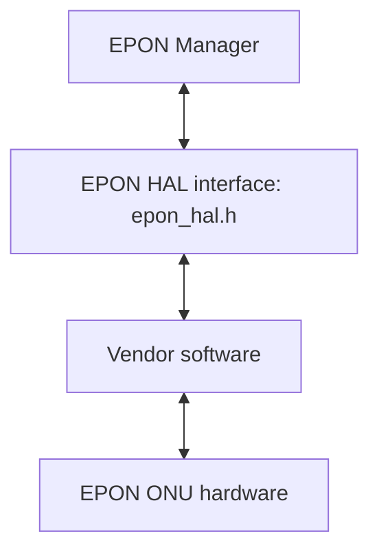
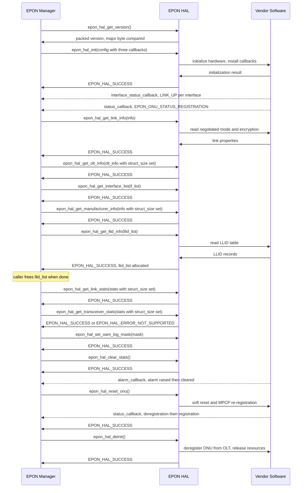
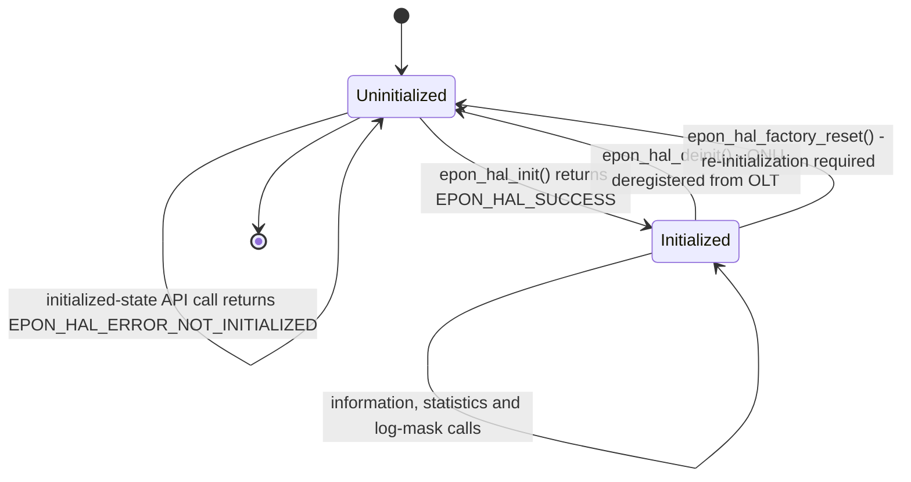
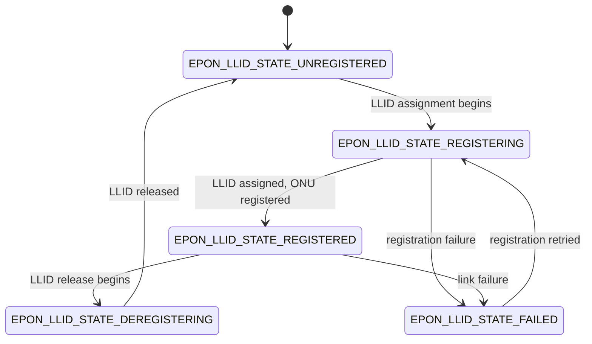

# EPON HAL Documentation

## Version History

| Date | Comment | Version |
| --- | --- | --- |
| 08/24/26 | Initial Release | 1.0.0 |

## Acronyms

- `HAL` \- Hardware Abstraction Layer
- `RDK-B` \- Reference Design Kit for Broadband Devices
- `API` \- Application Programming Interface
- `ABI` \- Application Binary Interface
- `PON` \- Passive Optical Network
- `EPON` \- Ethernet Passive Optical Network
- `WAN` \- Wide Area Network, the operator-facing side of the gateway
- `ONU` \- Optical Network Unit, the subscriber-side device this interface
  abstracts
- `OLT` \- Optical Line Terminal, the operator-side device the `ONU` registers
  with
- `LLID` \- Logical Link Identifier
- `MPCP` \- Multi-Point Control Protocol
- `OAM` \- Operations, Administration and Maintenance
- `DOCSIS` \- Data Over Cable Service Interface Specification
- `DPoE` \- DOCSIS Provisioning of EPON
- `CPE` \- Customer Premises Equipment
- `FEC` \- Forward Error Correction
- `MAC` \- Media Access Control
- `OUI` \- Organizationally Unique Identifier
- `AES` \- Advanced Encryption Standard
- `TR-181` \- Broadband Forum Device Data Model

## Description

The diagram below describes a high-level software architecture of the EPON HAL
module stack.

The EPON HAL is the common interface between the `EPON Manager` and a vendor's
software for the `ONU`, the `EPON` optical unit on the `WAN` (operator-facing)
side of the gateway. The `EPON Manager` calls the HAL, and the vendor's
software drives the `ONU` hardware underneath.

Through it the `EPON Manager` can read `LLID`, interface, `OLT` and
manufacturer information, read link and transceiver statistics, reset the
`ONU`, and control `OAM` logging. On `DPoE`-capable platforms it can also read
the `CPE` `MAC` table. The interface is declared in
[`epon_hal.h`](../../epon_hal.h), and each vendor supplies the implementation
behind it.

The HAL has one lifecycle per process, started by `epon_hal_init` and ended by
`epon_hal_deinit`. Ordinary calls return their result straight away
(synchronously). Status changes, alarms and interface up/down events arrive
separately through three callbacks that the caller registers at `epon_hal_init`.

## Optional Components

`DPoE` - DOCSIS Provisioning of EPON - is the optional extension provided by this
interface.

The optional surface is:

- `dpoe_hal_get_cpe_mac_table`, which returns the `CPE` `MAC` address table.
- `dpoe_cpe_mac_type_t`, distinguishing a statically configured entry from a
  dynamically learned one.
- `dpoe_cpe_mac_entry_t`, representing one table row.
- `dpoe_cpe_mac_table_t`, representing the complete `CPE` `MAC` table.
- `epon_vendor_alarm_t`, the vendor-specific alarm enumeration reported through
  the common alarm callback with `EPON_ALARM_TYPE_VENDOR_SPECIFIC`.

`epon_hal_config_t.dpoe_supported` carries the `DPoE` support setting during
initialization. On `DPoE`-capable platforms, `dpoe_hal_get_cpe_mac_table`
returns the current `CPE` `MAC` table.

## Component Runtime Execution Requirements

This section describes the lifecycle, execution, memory, notification and
error-handling requirements of the EPON HAL interface.

### Initialization and Startup

The EPON HAL has an explicit lifecycle and initialization order.

- `epon_hal_init` **must be called before other EPON HAL functions.** It takes a
  pointer to `epon_hal_config_t`, which must not be `NULL`, and the caller sets
  `struct_size` to `sizeof(epon_hal_config_t)`. The call installs the callback
  handlers, configures `DPoE` support and initializes the interface mapping.
- `epon_hal_deinit` tears the interface down. It unregisters callbacks, releases
  resources allocated during initialization, performs hardware cleanup and
  deregisters the `ONU` from the `OLT`. After deinitialization,
  `epon_hal_init` is called again before further HAL use.
- `epon_hal_factory_reset` restores factory defaults, clears custom settings and
  statistics, restores default operational parameters and requires
  re-initialization with `epon_hal_init`.

`epon_hal_init` returns `EPON_HAL_ERROR_INVALID_PARAM` for an invalid
configuration, `EPON_HAL_ERROR_WRONG_PON_MODE` when the hardware is provisioned
for another `PON` technology, `EPON_HAL_ERROR_HW_FAILURE` for hardware
initialization failure, `EPON_HAL_ERROR_CALLBACK_REG` for callback registration
failure, and `EPON_HAL_ERROR_TIMEOUT` when initialization is blocked for more
than three minutes.

### Threading Model

EPON HAL `API` calls use a synchronous request/return model. Asynchronous
status, alarm and interface notifications are delivered through callbacks
supplied in
`epon_hal_config_t`.

Vendor implementations manage the internal threading and event mechanisms used
to communicate with EPON hardware and deliver these notifications. Internal
resources are released during deinitialization.

### Process Model

The EPON HAL has a single per-process lifecycle.
`epon_hal_init` sets up the HAL state and `epon_hal_deinit` releases it.

### Memory Model

Memory ownership is split between the caller and the HAL. The caller allocates
and owns every request and fixed response structure it passes in. The HAL
allocates the two variable-length arrays it returns - for `LLID` information and
the `DPoE` `CPE` `MAC` table - which the caller frees after use.

#### Caller Responsibilities

- **Set `struct_size` on the five structures that carry it** -
  `epon_hal_link_stats_t`, `epon_hal_transceiver_stats_t`,
  `epon_onu_manufacturer_info_t`, `epon_olt_info_t` and `epon_hal_config_t`.
  Set each to the compiled size of the structure before the call; `API`s that
  validate it return `EPON_HAL_ERROR_INVALID_PARAM` for an invalid value.
- **Use the declared buffer-size constants** for the fixed-size character and
  byte arrays defined by the interface.

#### Module Responsibilities

- **Allocate and size the two result arrays.** `epon_llid_list_t.llid_list` is
  sized from `llid_count` and returned by `epon_hal_get_llid_info`;
  `dpoe_cpe_mac_table_t.cpe_list` is sized from
  `static_cpe_count + dynamic_cpe_count` and returned by
  `dpoe_hal_get_cpe_mac_table`. The caller frees both.
- **Release all internal memory on `epon_hal_deinit`,** which also performs
  hardware cleanup.

`epon_interface_list_t.interface` is different: a **fixed-capacity** array of
`EPON_HAL_MAX_INTERFACES` entries embedded in the caller-allocated structure,
with `interface_count` giving the populated prefix. No ownership transfer
applies to it - only `epon_llid_list_t.llid_list` and
`dpoe_cpe_mac_table_t.cpe_list` are allocated by the HAL and freed by the
caller.

### Power Management Requirements

The EPON HAL performs no power-management control operations. Its only
power-related behavior is reporting imminent power loss through the
`EPON_VENDOR_ALARM_DYING_GASP` alarm.

### Asynchronous Notification Model

The three callbacks in `epon_hal_config_t`, installed by `epon_hal_init`, carry
all the asynchronous notifications; `epon_hal_init` returns
`EPON_HAL_ERROR_CALLBACK_REG` if their registration fails.

- `status_callback(epon_onu_status_t)` is invoked on an `ONU` status change:
  `EPON_ONU_STATUS_LOS`, `EPON_ONU_STATUS_DOWNSTREAM_SIGNAL_DETECTED`,
  `EPON_ONU_STATUS_REGISTRATION` or `EPON_ONU_STATUS_DEREGISTRATION`.
- `alarm_callback(const epon_alarm_info_t *)` is invoked when an alarm is
  raised or cleared (`is_active`). `alarm_type` selects the standard IEEE
  802.3ah alarm or the vendor-specific alarm in the union, and `llid` gives
  the affected `LLID` (`EPON_LLID_NOT_APPLICABLE` for a device-wide alarm).
- `interface_status_callback(epon_onu_interface_info_t)` is invoked per
  interface on a layer-2 link change: `name` identifies it, and `status` is
  `EPON_ONU_INTF_STATUS_LINK_UP` or `EPON_ONU_INTF_STATUS_LINK_DOWN`.

### Blocking calls

`epon_hal_init` can block while initialization is in progress. If initialization
remains blocked for more than three minutes, the `API` returns
`EPON_HAL_ERROR_TIMEOUT`.

### Internal Error Handling

Errors are returned synchronously through `epon_hal_return_t`. Fourteen of the
fifteen public functions return this type; `epon_hal_get_version` returns the
packed version value directly.

The complete return-value vocabulary is:

| Code | Value | Meaning |
| --- | ---: | --- |
| `EPON_HAL_SUCCESS` | 0 | Operation completed successfully. |
| `EPON_HAL_ERROR_INVALID_PARAM` | -1 | Invalid parameter provided. |
| `EPON_HAL_ERROR_NOT_INITIALIZED` | -2 | HAL is not initialized. |
| `EPON_HAL_ERROR_HW_FAILURE` | -3 | Hardware operation failed. |
| `EPON_HAL_ERROR_NOT_SUPPORTED` | -4 | Operation is not supported. |
| `EPON_HAL_ERROR_TIMEOUT` | -5 | Operation timed out. |
| `EPON_HAL_ERROR_MEMORY` | -6 | Memory allocation failed. |
| `EPON_HAL_ERROR_RESOURCE` | -7 | Resource is unavailable. |
| `EPON_HAL_ERROR_CALLBACK_REG` | -8 | Callback registration failed. |
| `EPON_HAL_ERROR_CONFIG` | -9 | Configuration error. |
| `EPON_HAL_ERROR_WRONG_PON_MODE` | -10 | Hardware is configured for a `PON` mode other than EPON. |
| `EPON_HAL_ERROR` | -11 | General error. |

Each function documents the return codes applicable to its operation.

### Persistence Model

`epon_hal_factory_reset` clears custom settings and statistics, restoring
default operational parameters. After factory reset, `epon_hal_init` is called
to start a new initialized HAL lifecycle.

`epon_hal_deinit` ends the current initialized lifecycle. A subsequent HAL
session starts with a new `epon_hal_init` call and configuration structure.

## Non-functional requirements

The following non-functional requirements should be supported by the EPON `HAL`
component.

### Logging and debugging requirements

The EPON HAL provides a configurable logging front end through `HAL_LOG` and
`HAL_LOG_FUNCTION`.

**The severity ladder has eight levels,** declared by `hal_log_level_t`:

- **FATAL:** Fatal errors and critical failures.
- **ERROR:** Error conditions.
- **WARN:** Warning conditions.
- **NOTICE:** Normal but significant conditions.
- **INFO:** Informational messages.
- **OAM:** `OAM` protocol messages.
- **DEBUG:** Debug-level messages.
- **TRACE:** Trace-level detailed messages.

`HAL_LOG` takes a log level, a printf-style format string and matching
arguments, and forwards them together with the current function name and source
location to `HAL_LOG_FUNCTION`.

`HAL_LOG_FUNCTION` is the replaceable backend: define it before including the
header to route logs to a platform framework; the header ships examples for RDK
Logger, `printf` and syslog. If left undefined, the default backend appends
records to `/rdklogs/logs/EPONMANAGERLog.txt.0`.

`epon_hal_set_oam_log_mask` selects which `OAM` message categories are logged,
using `epon_oam_log_type_t` bits combined with bitwise OR. `EPON_OAM_ALL`
enables every category and a mask of zero disables `OAM` logging; selected
messages are logged at `HAL_LOG_LEVEL_OAM`. The mask affects logging only;
protocol processing continues regardless.

`MPCP` REGISTER and REGISTER_ACK have dedicated bits (`EPON_OAM_MPCP_REGISTER`
and `EPON_OAM_MPCP_REGISTER_ACK`), and organization-specific `OAM` messages
(`0xFE`) are logged via `EPON_OAM_VAR_REQUEST` and `EPON_OAM_VAR_RESPONSE`.

### Memory and performance requirements

Memory ownership follows the model described above: callers allocate fixed
response structures, while the HAL allocates the `LLID` and `DPoE` `CPE` table
arrays and returns their sizes through the associated count fields.

The variable-length allocation sizes are determined by `llid_count` and by the
sum of `static_cpe_count` and `dynamic_cpe_count`. Internal memory and resources
are managed by the HAL implementation and released during deinitialization.

### Quality Control

To ensure quality and reliability, third-party quality assurance tools such as
`Coverity`, `Black Duck` and `Valgrind` should be used to analyse an
implementation of this interface, with the goal of identifying memory leaks,
memory corruption and comparable defects before deployment.

Both the implementation and callers interacting with it should use disciplined
allocation, deallocation and error handling, with particular attention to the
`LLID` and `DPoE` `CPE` arrays allocated by the HAL and released by the caller.

A zero-warning compilation policy is appropriate for implementations, with
compiler warnings enabled by default.

### Licensing

The EPON HAL interface definition is licensed under the Apache License, Version
2.0. The repository includes the full license text in `LICENSE` and `COPYING`
and the attribution notice in `NOTICE`.

The public `epon_hal.h` header carries the Apache-2.0 license header and the RDK
Management copyright notice.

### Build Requirements

The EPON HAL implementation has to be compiled as a .so and linked to the
`EPON Manager` that consumes the interface.

The header depends on the C standard headers `stdint.h`, `stdbool.h` and
`stdio.h`, and provides `extern "C"` guards for use from C++.

### Variability Management

The EPON HAL interface follows Semantic Versioning. An implementation complies
with a specific interface version.

- `EPON_HAL_API_VERSION` packs the current version (1.0.0) as `0xMMmmpppp`:
  major in the upper byte, minor in the next byte and patch in the low sixteen
  bits.
- `epon_hal_get_version` returns the packed `API` version implemented by the
  linked HAL. Applications compare its major byte (`version >> 24`) against that
  of `EPON_HAL_API_VERSION` for `API`/`ABI` compatibility.
- A major version change represents an incompatible `API`/`ABI` change, a minor
  version change represents a backwards-compatible addition and a patch version
  change represents a backwards-compatible bug fix.

### Platform or Product Customization

The interface adapts to each platform through configuration and runtime values.

**DPoE support.** `epon_hal_config_t.dpoe_supported` tells the HAL at init
whether the platform supports `DPoE`; those platforms also expose the `CPE`
`MAC` table through `dpoe_hal_get_cpe_mac_table`.

**Logging backend.** Define `HAL_LOG_FUNCTION` to send logs to the platform's
own logging framework.

**Operational mode and encryption.** `epon_hal_get_link_info` fills
`epon_hal_link_info_t` with two fields:

- `mode` is a text string for the operational mode, such as `1G-EPON` or
  `10G-EPON`.
- `encryption` is an `epon_encryption_mode_t`: disabled, AES-128, triple
  churning or AES-256.

**WAN interfaces.** `epon_hal_get_interface_list` lists up to
`EPON_HAL_MAX_INTERFACES` interfaces, each with its `name` and current link
status.

**LLID and CPE capacities.** `epon_llid_list_t.max_llid_count` and
`dpoe_cpe_mac_table_t.max_cpe` report how many `LLID`s and `CPE`s the platform
supports.

## Interface API Documentation

### Data Structures and Defines

The types below make up the public EPON HAL interface. Callers fill them in or
read them back through the API.

**Callbacks** 
`epon_hal_config_t` holds three callback function pointers
installed by `epon_hal_init`. They are `status_callback(epon_onu_status_t)`,
`alarm_callback(const epon_alarm_info_t *)` and
`interface_status_callback(epon_onu_interface_info_t)`. Their behavior is
described under `Asynchronous Notification Model` above.

**Enumerations - thirteen**

| Type | What it represents |
| --- | --- |
| `hal_log_level_t` | The eight log severity levels, from FATAL down to TRACE, including an `OAM` level. |
| `epon_hal_return_t` | Almost every function returns one of these status codes (one success value plus eleven errors). |
| `epon_onu_status_t` | The overall `ONU` status (loss of signal, signal detected, registered, deregistered), delivered by `status_callback`. |
| `epon_interface_link_status_t` | One interface's link state, either up or down. |
| `epon_hal_alarm_t` | The seven standard IEEE 802.3ah alarms, plus a terminating `_MAX`. |
| `epon_vendor_alarm_t` | Eight vendor/`DPoE` alarms, such as dying gasp and optical-power thresholds, plus a terminating `_MAX`. |
| `epon_alarm_type_t` | Tells whether an alarm is standard or vendor-specific. |
| `epon_oam_log_type_t` | Bit flags for `OAM` message types; OR them together to build the log mask (`EPON_OAM_ALL` selects all). |
| `epon_llid_mode_t` | An `LLID` runs in unicast (point-to-point) or broadcast/multicast (shared) mode. |
| `epon_llid_state_t` | The `LLID`'s registration stage, one of five (see the State Diagram below). |
| `epon_llid_forwarding_state_t` | Whether an `LLID` blocks traffic, forwards it, or is still learning. |
| `epon_encryption_mode_t` | The encryption mode, one of disabled, AES-128, triple churning or AES-256 (AES-256 is a non-standard extension). |
| `dpoe_cpe_mac_type_t` | Whether a `CPE` `MAC` entry is static (configured) or dynamic (learned). |

**Structures - thirteen** The five marked with an asterisk have a `struct_size`
field the caller must set before the call.

| Type | What it represents |
| --- | --- |
| `epon_onu_interface_info_t` | Holds one interface's name and link status. |
| `epon_alarm_info_t` | Describes one alarm event, recording which alarm fired (standard or vendor), the affected `LLID`, and whether it was raised or cleared. |
| `epon_hal_link_stats_t` \* | Link counters (packets, bytes, errors, discards, `FEC`, `MAC` resets). Nine map to `TR-181`; the rest are EPON extensions. |
| `epon_hal_transceiver_stats_t` \* | Reports transmit and receive optical power and their thresholds (`TR-181`), plus laser bias current, temperature and supply voltage (vendor extensions). |
| `epon_llid_info_t` | Describes one `LLID`, with its value, mode, state, forwarding state, whether encryption is on, and its local `MAC` address. |
| `epon_llid_list_t` | The `LLID` table, holding the max supported, the current count, and the array of entries. **The HAL allocates the array; the caller frees it.** |
| `epon_onu_manufacturer_info_t` \* | `ONU` identity, covering manufacturer, model, hardware/software versions, serial number and vendor `OUI`. The first five map to `TR-181` `Device.DeviceInfo`. |
| `epon_hal_link_info_t` | The negotiated link, giving the operational mode (a string) and encryption mode (an enum). |
| `epon_interface_list_t` | The interface table, holding a count plus a built-in, fixed-size array of up to `EPON_HAL_MAX_INTERFACES` entries. |
| `epon_olt_info_t` \* | `OLT` identity learned at registration, holding its `OAM` `MAC` address (from `MPCP` GATE) and vendor `OUI` (from the `OAM` Information message). |
| `epon_hal_config_t` \* | Holds the `DPoE` support flag and the three callbacks passed to `epon_hal_init`. |
| `dpoe_cpe_mac_entry_t` | One `CPE` `MAC` entry, with its address, its type (static or dynamic), and age in seconds (0 for static). |
| `dpoe_cpe_mac_table_t` | The `CPE` `MAC` table, holding the max supported, the static and dynamic counts, and the array of entries. **The HAL allocates the array; the caller frees it.** |

**Macro constants**

| Macro group | What it provides |
| --- | --- |
| Version macros | The version numbers (`EPON_HAL_VERSION_MAJOR`, `_MINOR`, `_PATCH`), the `EPON_HAL_MAKE_VERSION` packing macro, and the assembled `EPON_HAL_API_VERSION`. See `Variability Management`. |
| Buffer lengths | The eleven fixed buffer sizes are `EPON_HAL_MAC_ADDR_LEN` 6, `EPON_HAL_VENDOR_OUI_LEN` 3, `EPON_HAL_MANUFACTURER_LEN` 32, `EPON_HAL_MODEL_NUMBER_LEN` 16, `EPON_HAL_HW_VERSION_LEN` 16, `EPON_HAL_SW_VERSION_LEN` 16, `EPON_HAL_SERIAL_NUMBER_LEN` 32, `EPON_HAL_MODE_LEN` 16, `EPON_HAL_MAX_INTERFACES` 16, `EPON_HAL_INTERFACE_NAME_LEN` 32 and `EPON_HAL_OLT_VENDOR_INFO_LEN` 64. |
| `LLID` sentinel | `EPON_LLID_NOT_APPLICABLE` (`0xFFFF`) marks an alarm as device-wide, not tied to one `LLID`. |
| Logging macros | `HAL_LOG` (the entry point) and `HAL_LOG_FUNCTION` (the replaceable backend). See `Logging and debugging requirements`. |

### API Surface

All fifteen functions, grouped by purpose. Full parameter and return-value
details are in [`epon_hal.h`](../../epon_hal.h).

**Lifecycle** (Every other function depends on these)

| Function | Purpose |
| --- | --- |
| `epon_hal_init` | Set up the interface from a caller-supplied configuration and install the three callbacks. Must be called before anything else. |
| `epon_hal_deinit` | Tear the interface down, release resources and deregister the `ONU` from the `OLT`. Re-initialize before using it again. |

**Version**

| Function | Purpose |
| --- | --- |
| `epon_hal_get_version` | Return the implementation's packed `API` version (`0xMMmmpppp`) for a runtime `ABI` compatibility check. Returns the value directly, not a status code. |

**Information** (read-only)

| Function | Purpose |
| --- | --- |
| `epon_hal_get_link_info` | Read the negotiated operational mode and encryption mode. |
| `epon_hal_get_llid_info` | Read the `LLID` table. **Allocates an array the caller must free.** |
| `epon_hal_get_olt_info` | Read the `OLT` `MAC` address and vendor `OUI` (available after the `ONU` registers). |
| `epon_hal_get_manufacturer_info` | Read the `ONU` manufacturer, model, hardware/software versions, serial number and vendor `OUI`. |
| `epon_hal_get_interface_list` | List the configured interfaces with their names and link states. |

**Statistics**

| Function | Purpose |
| --- | --- |
| `epon_hal_get_link_stats` | Read the link counters for packets, bytes, errors, discards, `FEC` and `MAC` resets. |
| `epon_hal_get_transceiver_stats` | Read optical measurements and thresholds (on platforms that support it). |
| `epon_hal_clear_stats` | Reset the link counters, leaving the optical power measurements unchanged. |

**Maintenance** (The first two disrupt service)

| Function | Purpose |
| --- | --- |
| `epon_hal_reset_onu` | Soft-reset the `ONU` and re-register through `MPCP` discovery; the HAL stays initialized. |
| `epon_hal_factory_reset` | Restore factory defaults, losing all configuration. **Re-initialize afterwards.** |
| `epon_hal_set_oam_log_mask` | Choose which `OAM` message types are logged. Affects logging only, never processing. |
| `dpoe_hal_get_cpe_mac_table` | Read the `CPE` `MAC` table (`DPoE` only). **Allocates an array the caller must free.** |

### Sequence Diagram

The exchange below shows a typical lifecycle in which a caller checks the `API`
version, initializes the HAL, receives registration notifications, reads EPON
information and statistics, performs maintenance operations and deinitializes
the HAL.

`dpoe_hal_get_cpe_mac_table` is used after initialization on `DPoE`-capable
platforms. The returned `cpe_list` array is released by the caller after use.

### State Diagram

**The HAL lifecycle.** `epon_hal_init` enters the initialized state.
`epon_hal_deinit` and `epon_hal_factory_reset` return the HAL to a state that
requires initialization before further use. `epon_hal_reset_onu` performs an
`ONU` reset and re-registration while keeping the HAL lifecycle initialized.

**The LLID registration lifecycle.** `epon_llid_state_t` represents the `LLID`
registration stages. The current stage is reported through
`epon_llid_info_t.state` in the table returned by `epon_hal_get_llid_info`.

**Aggregate ONU status.** `epon_onu_status_t` reports
`EPON_ONU_STATUS_LOS`, `EPON_ONU_STATUS_DOWNSTREAM_SIGNAL_DETECTED`,
`EPON_ONU_STATUS_REGISTRATION` and `EPON_ONU_STATUS_DEREGISTRATION` through
`status_callback`. `EPON_ONU_STATUS_REGISTRATION` is reported after all
configured interfaces reach `EPON_ONU_INTF_STATUS_LINK_UP`.

`epon_interface_link_status_t` reports `EPON_ONU_INTF_STATUS_LINK_DOWN` and
`EPON_ONU_INTF_STATUS_LINK_UP` through `interface_status_callback`.
